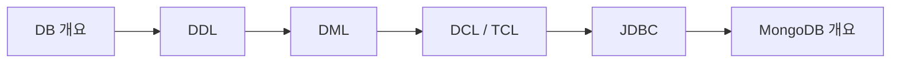
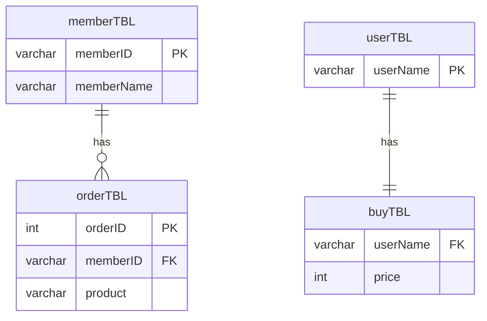
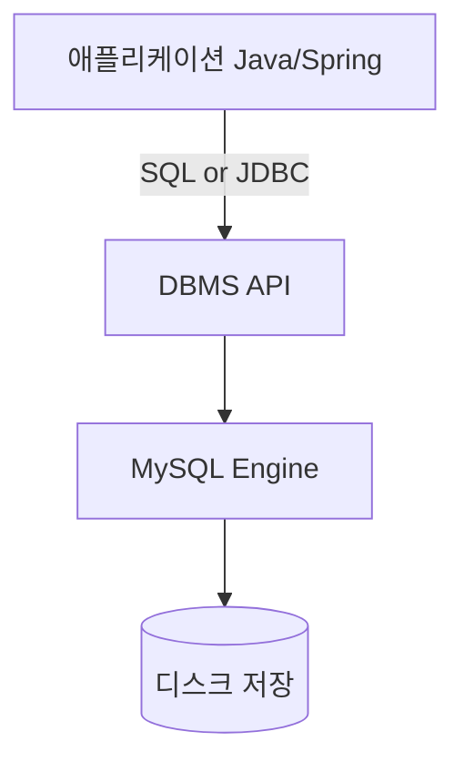
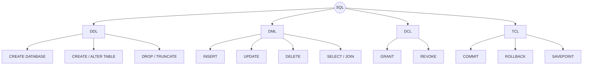
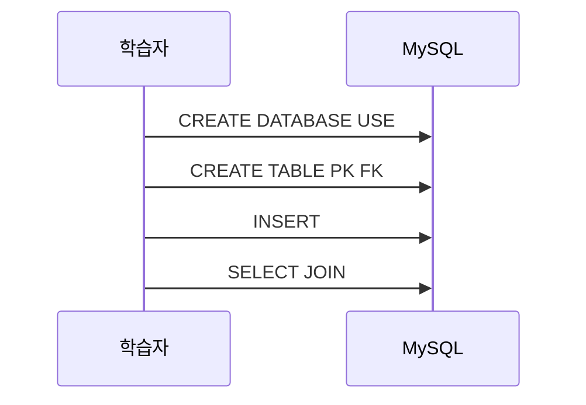
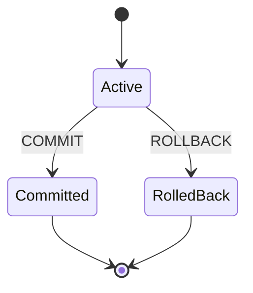
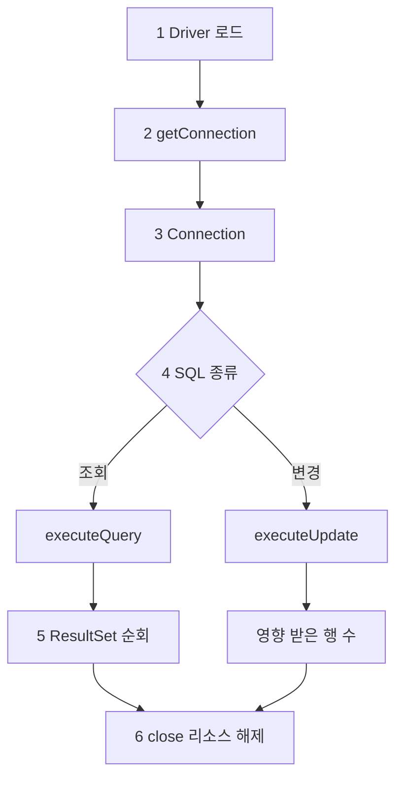
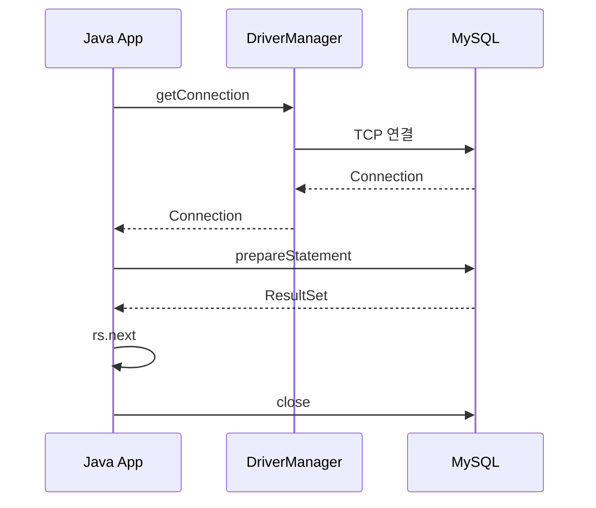
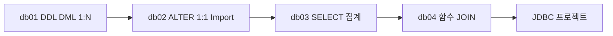
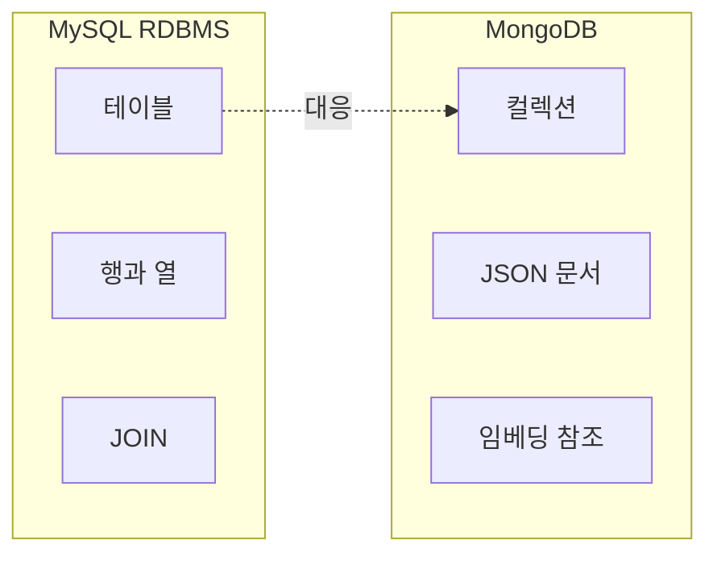

# KB7-DB — 데이터베이스 수업 개요

**MySQL** 중심으로 SQL 기초를 익힌 뒤, 애플리케이션에서 **JDBC**로 DB에 접속하는 흐름까지 진행합니다. (추가: **MongoDB** NoSQL 개요)

---

## 수업 진행 순서



| 단계 | 폴더·자료 | 핵심 |
|------|-----------|------|
| DB 개요 | 공통 | RDBMS, 스키마, 테이블, PK/FK, ERD, 1:N·1:1 |
| DDL · DML | [db01](db01/) | `CREATE` / `INSERT`, 1:N JOIN |
| DDL 심화 | [db02](db02/) | `ALTER`, PK/FK, CSV Import |
| SELECT · 집계 | [db03](db03/) | `SELECT`, 서브쿼리, `GROUP BY` |
| 내장 함수 · JOIN | [db04](db04/) | `IF`/`CASE`, 내장 함수, INNER/LEFT/SELF JOIN |
| JDBC | (Java) | Driver → Connection → SQL 실행 → ResultSet |
| NoSQL | (예정) | 문서 DB, 컬렉션 개념 |

---

## 1. DB 개요

| 개념 | 설명 |
|------|------|
| **DBMS** | 데이터를 저장·조회·관리하는 시스템 (MySQL, MariaDB 등) |
| **스키마(Database)** | 테이블·뷰 등 객체가 묶인 논리 단위 (`shopdb`, `day2db`) |
| **테이블(Table)** | 행(Row) · 열(Column)으로 구성된 관계형 데이터 단위 |
| **PK / FK** | 기본키(고유 식별) · 외래키(다른 테이블 참조) |
| **ERD** | 테이블 간 관계를 그림으로 표현 (1:N, 1:1) |



**3계층 관점 (애플리케이션 ↔ DB)**



---

## 2. SQL 분류 — DDL / DML / DCL / TCL



| 분류 | 역할 | 대표 명령 | 수업 매핑 |
|------|------|-----------|-----------|
| **DDL** | 구조 정의·변경 | `CREATE`, `ALTER`, `DROP`, `TRUNCATE` | db01 `CREATE TABLE`, db02 `ALTER` PK/FK |
| **DML** | 데이터 조작·조회 | `INSERT`, `UPDATE`, `DELETE`, `SELECT` | db01 `INSERT`, db03 조회·집계, db04 함수·JOIN |
| **DCL** | 권한 제어 | `GRANT`, `REVOKE` | 사용자·권한 개념 |
| **TCL** | 트랜잭션 제어 | `COMMIT`, `ROLLBACK` | 여러 DML을 하나의 작업 단위로 묶기 |

### DDL → DML → 조회 흐름 (db01 기준)



### 트랜잭션(TCL) 개념



> `autocommit=1`(기본)이면 DML 한 문장마다 자동 `COMMIT`. 여러 문장을 묶을 때는 `START TRANSACTION` → 성공 시 `COMMIT`, 실패 시 `ROLLBACK`.

### SQL vs JDBC 역할

| 구분 | SQL (Workbench/CLI) | JDBC (Java) |
|------|---------------------|-------------|
| 실행 주체 | 사람이 직접 쿼리 입력 | 애플리케이션 코드 |
| 결과 | 그리드·텍스트 출력 | `ResultSet` 객체 |
| 연결 | Workbench 세션 | `Connection` 풀 |

---

## 3. JDBC 흐름

Java 애플리케이션이 MySQL과 통신하는 **표준 단계**입니다. SQL에서 익힌 DML·`SELECT`가 **문자열 또는 PreparedStatement**로 전달됩니다.





| 단계 | API / 개념 | 설명 |
|------|------------|------|
| 1 | `Class.forName` 또는 SPI | `com.mysql.cj.jdbc.Driver` (Connector/J) |
| 2 | `DriverManager.getConnection` | URL · 사용자 · 비밀번호 |
| 3 | `Connection` | 세션 단위 DB 연결 |
| 4 | `PreparedStatement` | `?` 바인딩으로 SQL Injection 방지 |
| 5 | `ResultSet` | 조회 결과 커서 (`next()`, `getString(...)`) |
| 6 | `close()` | 리소스 반환 (try-with-resources 권장) |

**JDBC URL 예시**

```text
jdbc:mysql://localhost:3306/shopdb?serverTimezone=Asia/Seoul&characterEncoding=UTF-8
```

**CRUD ↔ SQL 매핑**

| JDBC | SQL | 용도 |
|------|-----|------|
| `executeQuery()` | `SELECT` | 조회 → `ResultSet` |
| `executeUpdate()` | `INSERT` / `UPDATE` / `DELETE` | 변경 → 영향 행 수 |

---

## 4. 주차별 실습 자료



| 폴더 | 파일 | 내용 |
|------|------|------|
| [db01/](db01/) | `day1.sql` | `shopdb`, `memberTBL`·`orderTBL`, 1:N FK, JOIN |
| [db02/](db02/) | `day2.sql` | `ALTER` PK/FK, 1:1, CSV/JSON Import |
| [db03/](db03/) | `day3.sql` | `WHERE`, 서브쿼리, `GROUP BY`, `HAVING` |
| [db04/](db04/) | `day4.sql` | 내장 함수, INNER/LEFT JOIN, SELF JOIN |

상세 가이드: [db01/README.md](db01/README.md) · [db02/README.md](db02/README.md) · [db03/README.md](db03/README.md) · [db04/README.md](db04/README.md)

---

## 5. 환경 · 도구

- **MySQL** + **MySQL Workbench** (스키마 설계, 쿼리 실행)
- **CLI:** `mysql -h 호스트 -P 포트 -u 사용자 -p`
- **ERD:** [erdcloud.com](https://www.erdcloud.com/) — ERD ↔ SQL 변환
- **JDBC:** MySQL Connector/J, Maven/Gradle 의존성 추가

---

## 6. MongoDB (예정 개요)

관계형(MySQL) 이후 **문서 지향 NoSQL**을 비교합니다.



| MySQL | MongoDB |
|-------|---------|
| Database | Database |
| Table | Collection |
| Row | Document (BSON/JSON) |
| Column | Field |
| JOIN | `$lookup` 또는 임베딩 |
