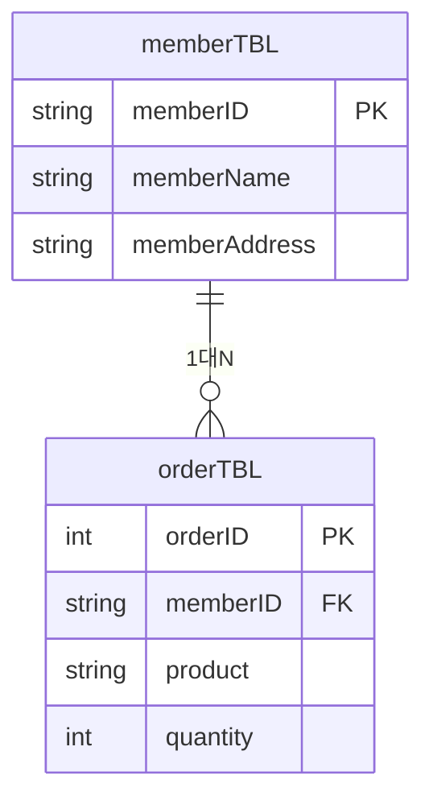
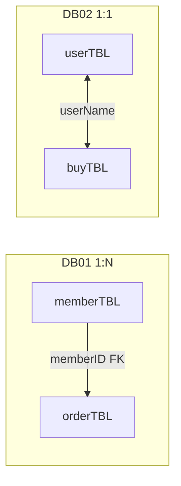
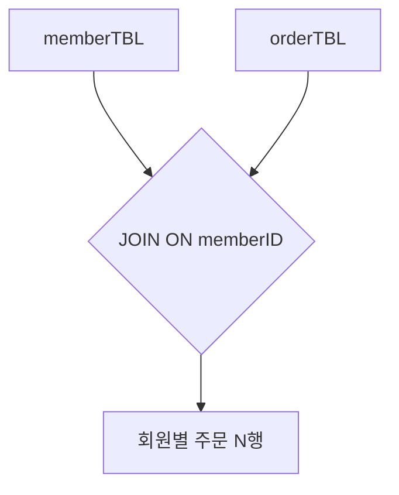
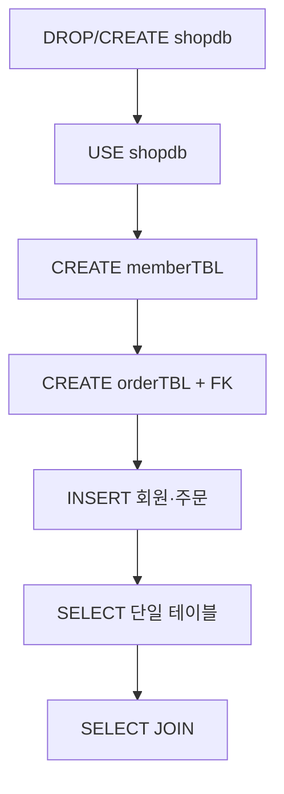
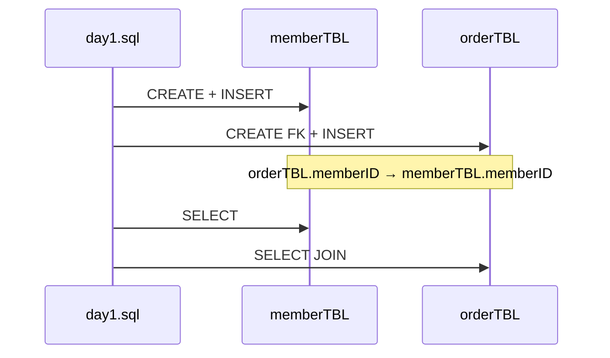

# DB01 - SQL 학습 가이드

## 📋 프로젝트 개요

이 프로젝트는 **기본 SQL(DDL·DML)** 과 **1:N 관계(PK/FK)** 를 중심으로 SQL을 학습하기 위한 자료입니다.

- `shopdb` : 쇼핑몰 예제 데이터베이스
- `memberTBL` / `orderTBL` : 회원 1명이 **여러 주문**을 가질 수 있는 **1:N** 구조
- `day1.sql` : DB 생성 → 테이블 생성 → INSERT → SELECT·JOIN 실습

---

## 🗂️ 데이터베이스 구조

### ERD — memberTBL ↔ orderTBL (1:N)



> `orderTBL.memberID` 가 `memberTBL.memberID` 를 참조합니다. (`fk_order_member`)

### DB01 vs DB02 관계 비교



---

## 📊 테이블 정보

### 1️⃣ memberTBL (회원 테이블)

| 컬럼명 | 데이터타입 | 제약조건 | 설명 |
|--------|-----------|--------|------|
| memberID | VARCHAR(20) | PRIMARY KEY | 회원 고유 ID |
| memberName | VARCHAR(50) | NOT NULL | 회원 이름 |
| memberAddress | VARCHAR(100) | NULL | 회원 주소 |

**샘플 데이터:**

| memberID | memberName | memberAddress |
|----------|-----------|---------------|
| user01 | 김철수 | 서울 |
| user02 | 이영희 | 부산 |
| user03 | 박민수 | 대전 |
| user04 | 최지연 | 광주 |

---

### 2️⃣ orderTBL (주문 테이블)

| 컬럼명 | 데이터타입 | 제약조건 | 설명 |
|--------|-----------|--------|------|
| orderID | INT | PRIMARY KEY | 주문 고유 ID |
| memberID | VARCHAR(20) | FOREIGN KEY | 회원 ID (`memberTBL` 참조) |
| product | VARCHAR(50) | NOT NULL | 주문 상품명 |
| quantity | INT | NOT NULL | 주문 수량 |

**샘플 데이터:**

| orderID | memberID | product | quantity |
|---------|----------|---------|----------|
| 1001 | user01 | 노트북 | 1 |
| 1002 | user02 | 키보드 | 1 |
| 1003 | user01 | 마우스 | 2 |
| 1004 | user03 | 모니터 | 1 |

> 한 회원(`user01`)이 주문을 **여러 건** 가질 수 있어 1:N 관계입니다.

---

## 🔍 주요 SQL 쿼리

### 기본 조회
```sql
-- 전체 회원 조회
SELECT * FROM memberTBL;

-- 전체 주문 조회
SELECT * FROM orderTBL;
```

### 1:N JOIN 흐름



### 조건부 조회
```sql
-- 특정 회원 조회
SELECT * FROM memberTBL WHERE memberName = '김철수';
```

### JOIN 조회
```sql
-- 주문한 회원 이름과 상품 조회
SELECT
    m.memberName AS 회원명,
    o.product AS 상품명,
    o.quantity AS 수량
FROM memberTBL m
JOIN orderTBL o ON m.memberID = o.memberID;
```

**결과 예시:**

| 회원명 | 상품명 | 수량 |
|--------|--------|------|
| 김철수 | 노트북 | 1 |
| 이영희 | 키보드 | 1 |
| 김철수 | 마우스 | 2 |
| 박민수 | 모니터 | 1 |

### 필터링된 JOIN
```sql
-- 특정 상품을 주문한 회원 조회
SELECT
    m.memberName AS 회원명,
    o.product AS 상품명
FROM memberTBL m
JOIN orderTBL o ON m.memberID = o.memberID
WHERE o.product = '노트북';
```

---

## 📝 학습 목표

✅ `CREATE DATABASE` / `USE` 로 DB 선택  
✅ `CREATE TABLE` 과 PRIMARY KEY / FOREIGN KEY  
✅ `INSERT` 로 샘플 데이터 적재  
✅ `SELECT` · `WHERE` 기본 조회  
✅ `JOIN` 으로 1:N 관계 조회  
✅ `WHERE` 와 JOIN 조합 필터링  

---

## 🚀 실행 방법

1. MySQL Workbench 또는 CLI에서 `day1.sql` 을 **위에서부터 순서대로** 실행합니다.
2. `shopdb` 가 생성되고 `memberTBL` · `orderTBL` 에 데이터가 들어갑니다.
3. 위 **주요 SQL 쿼리** 를 실행해 결과를 확인합니다.

> 실행 전 Workbench 왼쪽 스키마에서 DB가 선택되어 있는지 확인하세요. 선택된 DB가 없으면 쿼리가 실패할 수 있습니다.

### 실행 흐름



### day1.sql — DDL → DML 순서



---

## 📁 파일 구성

| 파일 | 설명 |
|------|------|
| `day1.sql` | `shopdb` 생성, `memberTBL`·`orderTBL` DDL/DML, SELECT·JOIN 실습 |

---

## 📐 다이어그램 요약 (Mermaid)

| 다이어그램 | 유형 | 설명 |
|-----------|------|------|
| memberTBL ↔ orderTBL | `erDiagram` | 1:N ERD |
| DB01 vs DB02 | `flowchart` | 1:N vs 1:1 비교 |
| 1:N JOIN | `flowchart` | JOIN 조회 흐름 |
| 실행 흐름 | `flowchart` | day1 학습 순서 |
| DDL → DML | `sequenceDiagram` | 테이블·데이터·조회 단계 |

### day1.sql 핵심 스크립트

```sql
DROP DATABASE IF EXISTS shopdb;
CREATE DATABASE shopdb;
USE shopdb;

CREATE TABLE memberTBL (
    memberID VARCHAR(20) PRIMARY KEY,
    memberName VARCHAR(50) NOT NULL,
    memberAddress VARCHAR(100)
);

CREATE TABLE orderTBL (
    orderID INT PRIMARY KEY,
    memberID VARCHAR(20) NOT NULL,
    product VARCHAR(50) NOT NULL,
    quantity INT NOT NULL,
    CONSTRAINT fk_order_member
        FOREIGN KEY (memberID)
        REFERENCES memberTBL(memberID)
);

INSERT INTO memberTBL (memberID, memberName, memberAddress) VALUES
('user01', '김철수', '서울'),
('user02', '이영희', '부산'),
('user03', '박민수', '대전'),
('user04', '최지연', '광주');

INSERT INTO orderTBL (orderID, memberID, product, quantity) VALUES
(1001, 'user01', '노트북', 1),
(1002, 'user02', '키보드', 1),
(1003, 'user01', '마우스', 2),
(1004, 'user03', '모니터', 1);

SELECT m.memberName AS 회원명, o.product AS 상품명, o.quantity AS 수량
FROM memberTBL m
JOIN orderTBL o ON m.memberID = o.memberID;
```

<br><br>

### MySQL Workbench · 환경 설정 (공통)


- **샘플 DB 다운로드:** [MySQL Documentation - Other Docs](https://dev.mysql.com/doc/index-other.html)  
  

- **CLI 접속 예시**
  ```text
  mysql -h 호스트 -P 포트 -u 사용자id -p
  # -h 생략 시 localhost, -P 생략 시 3306
  ```

- **ERD (memberTBL · orderTBL)**  
  
  

- **Safe Update 해제 (필요 시)**  
  

---

## 🔗 참고

- DB02에서는 **1:1** (`userTBL` ↔ `buyTBL`), DB03에서는 **DQL** (`SELECT`, 서브쿼리, `GROUP BY`) 을 다룹니다.
- [db02/README.md](../db02/README.md) · [db03/README.md](../db03/README.md)
