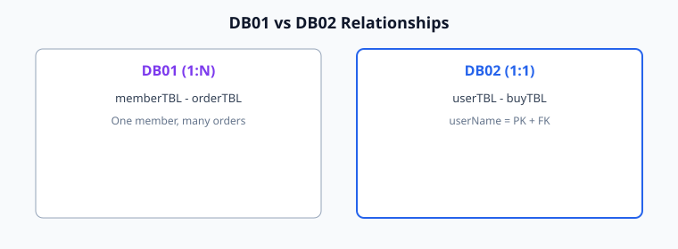
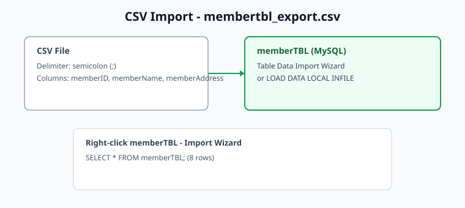

# DB02 - SQL 학습 가이드

## 📋 프로젝트 개요

이 프로젝트는 **DDL(ALTER TABLE)** 과 **제약조건(PK/FK)** 을 중심으로 SQL을 학습하기 위한 자료입니다.

- `userTBL` / `buyTBL` : **1:1 관계** (구매 정보는 회원당 최대 1건)
- `memberTBL` / `productTBL` : 회원·상품 마스터 테이블 (FK 없이 독립 구성)
- `membertbl_export.csv` : `memberTBL` 샘플 데이터 (CSV 가져오기 연습)

---

## 🗂️ 데이터베이스 구조

### 테이블 설계도

```
┌─────────────────────────┐         ┌─────────────────────────┐
│       userTBL           │   1:1   │       buyTBL            │
├─────────────────────────┤◄───────►├─────────────────────────┤
│ userName (PK)           │         │ userName (PK, FK)       │
│ birthYear               │         │ prodName                │
│ addr                    │         │ price                   │
│ mobile                  │         │ amount                  │
└─────────────────────────┘         └─────────────────────────┘


┌─────────────────────────┐         ┌─────────────────────────┐
│      memberTBL          │         │     productTBL        │
├─────────────────────────┤         ├─────────────────────────┤
│ memberID (PK)           │         │ productName (PK)        │
│ memberName              │         │ cost                    │
│ memberAddress           │         │ makeDate                │
└─────────────────────────┘         │ company                 │
                                    │ amount                  │
                                    └─────────────────────────┘
```

---

## 📊 테이블 정보

### 1️⃣ userTBL (고객 테이블)

| 컬럼명 | 데이터타입 | 제약조건 | 설명 |
|--------|-----------|--------|------|
| userName | VARCHAR(3) | PRIMARY KEY | 고객 이름 (PK) |
| birthYear | INT | NULL | 출생 연도 |
| addr | VARCHAR(2) | NULL | 주소 |
| mobile | VARCHAR(12) | NOT NULL | 휴대폰 번호 |

---

### 2️⃣ buyTBL (구매 테이블, 1:1)

| 컬럼명 | 데이터타입 | 제약조건 | 설명 |
|--------|-----------|--------|------|
| userName | VARCHAR(3) | PRIMARY KEY, FOREIGN KEY | 고객 이름 (`userTBL` 참조) |
| prodName | VARCHAR(3) | NULL | 상품명 |
| price | INT | NULL | 가격 |
| amount | INT | NULL | 수량 |

> `buyTBL.userName` 이 PK이면서 FK이므로, 한 고객당 구매 행은 **최대 1개** (1:1 관계).

---

### 3️⃣ memberTBL (회원 테이블)

| 컬럼명 | 데이터타입 | 제약조건 | 설명 |
|--------|-----------|--------|------|
| memberID | VARCHAR(256) | PRIMARY KEY | 회원 고유 ID |
| memberName | VARCHAR(500) | NULL | 회원 이름 |
| memberAddress | VARCHAR(500) | NULL | 회원 주소 |

**CSV 샘플 데이터 (`membertbl_export.csv`):**

| memberID | memberName | memberAddress |
|----------|-----------|---------------|
| Choi | 최지훈 | 대구 수성구 범어동 |
| Dang | 당당이 | 경기 부천시 중동 |
| Han | 한주연 | 인천 남구 주안동 |
| Jee | 지은이 | 서울 은평구 증산동 |
| Kim | 김민수 | 서울 강남구 역삼동 |
| Lee2 | 이하늘 | 광주 북구 용봉동 |
| Park | 박서연 | 부산 해운대구 우동 |
| Sang | 상길이 | 경기 성남시 분당구 |

---

### 4️⃣ productTBL (상품 테이블)

| 컬럼명 | 데이터타입 | 제약조건 | 설명 |
|--------|-----------|--------|------|
| productName | VARCHAR(500) | PRIMARY KEY | 상품명 |
| cost | INT | NULL | 원가 |
| makeDate | VARCHAR(500) | NULL | 제조일 |
| company | VARCHAR(500) | NULL | 제조사 |
| amount | INT | NULL | 재고 수량 |

---

## 🔍 주요 SQL 쿼리

### 기본 조회
```sql
-- 전체 회원 조회
SELECT * FROM memberTBL;

-- 전체 상품 조회
SELECT * FROM productTBL;

-- 고객·구매 조회 (1:1 JOIN)
SELECT *
FROM userTBL u
JOIN buyTBL b ON u.userName = b.userName;
```

### 조건부 조회
```sql
-- 특정 회원 조회
SELECT * FROM memberTBL WHERE memberName = '김민수';

-- 특정 지역 회원 조회
SELECT * FROM memberTBL WHERE memberAddress LIKE '%서울%';
```

### CSV 데이터 적재 (예시)
```sql
-- 테이블 생성 후, Workbench Import 또는 LOAD DATA 사용
LOAD DATA LOCAL INFILE 'membertbl_export.csv'
INTO TABLE memberTBL
FIELDS TERMINATED BY ';'
ENCLOSED BY '"'
LINES TERMINATED BY '\n'
IGNORE 1 ROWS
(memberID, memberName, memberAddress);
```

> CSV 경로·`LOCAL INFILE` 허용 여부는 환경에 따라 다릅니다. MySQL Workbench **Table Data Import Wizard** 로 가져와도 됩니다.

---

## 📝 학습 목표

✅ `CREATE TABLE` 로 테이블 정의  
✅ `ALTER TABLE` 로 PRIMARY KEY / FOREIGN KEY 추가  
✅ 1:1 관계 (PK = FK 컬럼) 이해  
✅ CSV 파일로 데이터 적재  
✅ `JOIN` 으로 연관 테이블 조회  
✅ `WHERE` / `LIKE` 조건절 필터링  

---

## 🚀 실행 방법

1. 사용할 데이터베이스를 선택하거나 생성합니다.
   ```sql
   CREATE DATABASE IF NOT EXISTS day2db;
   USE day2db;
   ```
2. `day2.sql` 파일의 SQL 문을 **순서대로** 실행합니다. (테이블 생성 → `ALTER` 로 PK/FK 설정)
3. `membertbl_export.csv` 를 이용해 `memberTBL` 에 데이터를 적재합니다.
4. 위 **주요 SQL 쿼리** 를 실행해 결과를 확인합니다.

<hr>


---

## 📁 파일 구성

| 파일 | 설명 |
|------|------|
| `day2.sql` | `userTBL`, `buyTBL`, `memberTBL`, `productTBL` DDL 및 제약조건 |
| `membertbl_export.csv` | `memberTBL` 회원 샘플 데이터 (세미콜론 구분) |
| `images/*.svg` | ERD, 실행 흐름, CSV 가져오기, DB01/DB02 비교 다이어그램 |

---

## 🖼️ 참고 이미지

### 실행 흐름


### ERD (1:1 · 마스터 테이블)

<br>


### DB01 vs DB02 관계 비교


### CSV 가져오기


<br><br>

### day2.sql 전체 스크립트

```sql
CREATE TABLE `userTBL` (
	`userName`	varchar(3)	NOT NULL	COMMENT '고객이름, 실제로는 256글자로 설정',
	`birthYear`	int	NULL,
	`addr`	varchar(2)	NULL,
	`mobile`	varchar(12)	NOT NULL
);

CREATE TABLE `buyTBL` (
	`userName`	varchar(3)	NOT NULL	COMMENT '고객이름, 실제로는 256글자로 설정',
	`prodName`	varchar(3)	NULL,
	`price`	int	NULL,
	`amount`	int	NULL
);

ALTER TABLE `userTBL` ADD CONSTRAINT `PK_USERTBL` PRIMARY KEY (
	`userName`
);

ALTER TABLE `buyTBL` ADD CONSTRAINT `PK_BUYTBL` PRIMARY KEY (
	`userName`
);

ALTER TABLE `buyTBL` ADD CONSTRAINT `FK_userTBL_TO_buyTBL_1` FOREIGN KEY (
	`userName`
)
REFERENCES `userTBL` (
	`userName`
);

CREATE TABLE `memberTBL` (
	`memberID`	varchar(256)	NOT NULL,
	`memberName`	varchar(500)	NULL,
	`memberAddress`	varchar(500)	NULL
);

CREATE TABLE `productTBL` (
	`productName`	varchar(500)	NOT NULL,
	`cost`	int	NULL,
	`makeDate`	varchar(500)	NULL,
	`company`	varchar(500)	NULL,
	`amount`	int	NULL
);

ALTER TABLE `memberTBL` ADD CONSTRAINT `PK_MEMBERTBL` PRIMARY KEY (
	`memberID`
);

ALTER TABLE `productTBL` ADD CONSTRAINT `PK_PRODUCTTBL` PRIMARY KEY (
	`productName`
);
```

<br><br>

### MySQL Workbench · ERD (공통)

db01 강의 자료와 동일한 Workbench·ERD·환경 설정 스크린샷입니다.

<br>
- ERD<br>


<br><br>
- 샘플데이터 다운로드/설치 : https://dev.mysql.com/doc/index-other.html<br>


<br><br>
- delete/update 해제 (Safe Updates)<br>


---

## 🔗 참고

- MySQL 설치·Workbench·CLI 접속 등 공통 환경 설정은 [db01/README.md](../db01/README.md) 를 참고하세요.
- DB01에서는 **1:N** (`memberTBL` ↔ `orderTBL`), DB02에서는 **1:1** (`userTBL` ↔ `buyTBL`) 관계를 다룹니다.
- DB02 전용 다이어그램은 `db02/images/` 폴더에 있습니다.
