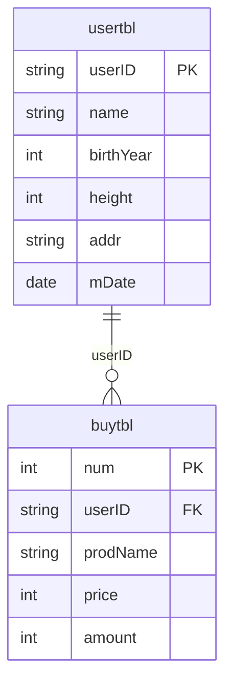
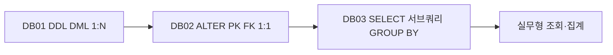
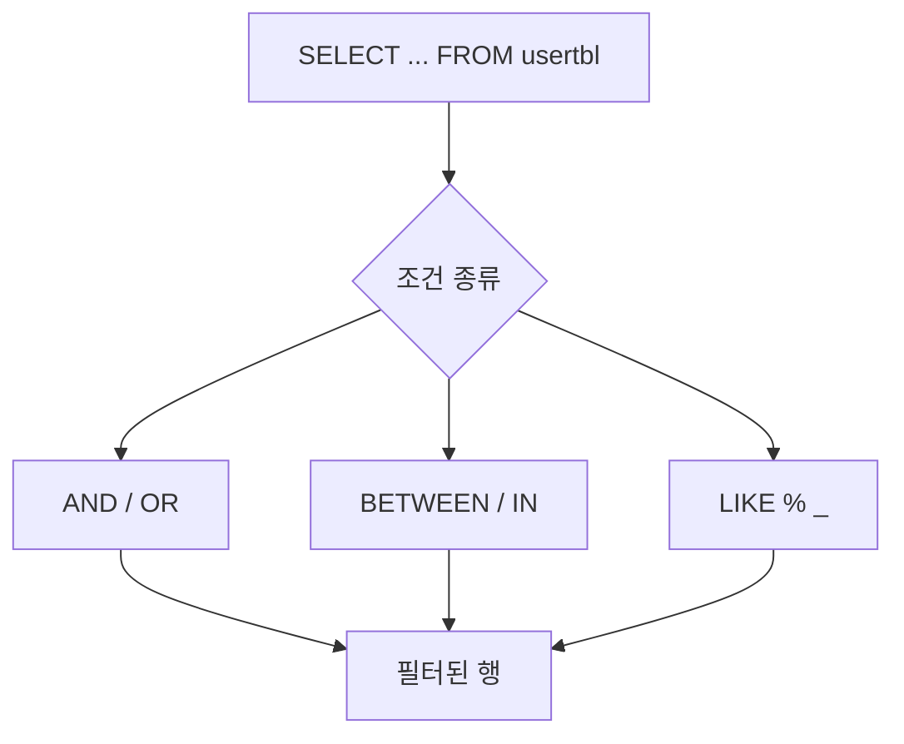
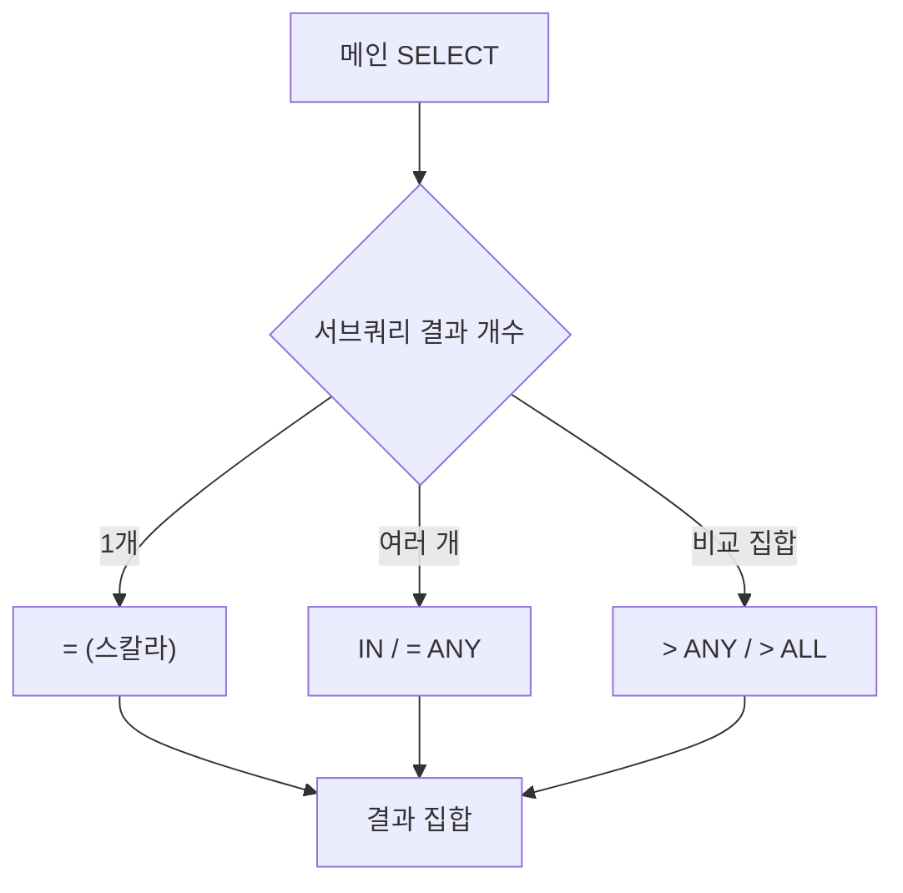
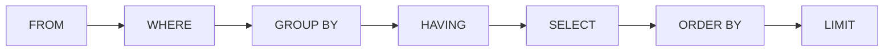
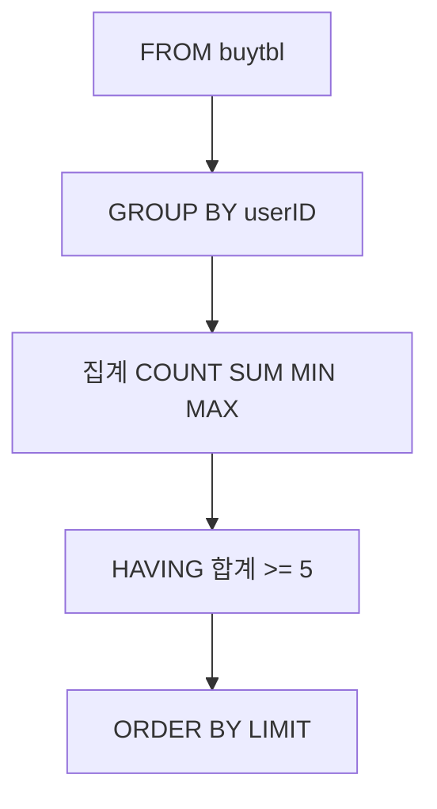
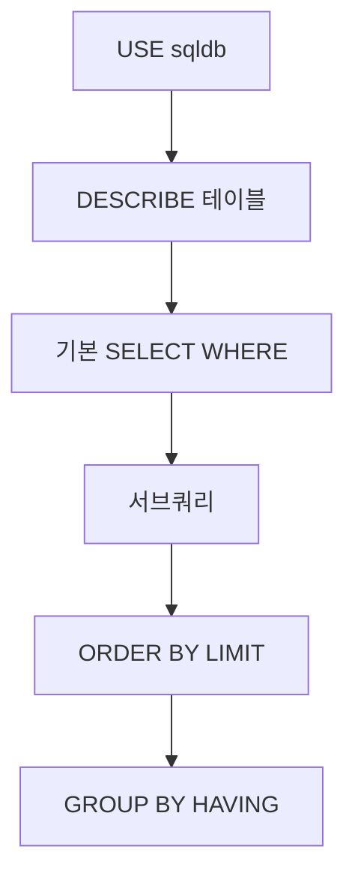

# DB03 - SQL 학습 가이드 (DQL)

## 📋 프로젝트 개요

이 프로젝트는 **DQL(Data Query Language)** 을 중심으로 `SELECT` 문법을 학습하기 위한 자료입니다.

- **전제:** `sqldb` 등 샘플 DB에 `usertbl` · `buytbl` 이 이미 존재한다고 가정합니다.
- `usertbl` : 회원(사용자) 정보 — `WHERE`, `LIKE`, 서브쿼리, `ORDER BY` 실습
- `buytbl` : 구매 내역 — `GROUP BY`, 집계 함수, `HAVING`, `LIMIT` 실습
- `day3.sql` : 조회·필터·서브쿼리·정렬·그룹 집계 쿼리 모음

---

## 🗂️ 사용 테이블 구조

### ERD — usertbl · buytbl (1:N, 샘플 DB)



> DB02의 `userTBL`/`buyTBL`(1:1)과 **이름·스키마가 다릅니다.** day3는 교재용 **소문자** `usertbl`/`buytbl` 을 사용합니다.

### DB01 → DB02 → DB03 학습 흐름



---

## 📊 테이블 정보 (day3.sql 기준)

### 1️⃣ usertbl (회원)

| 컬럼명 | 설명 | day3.sql 예시 |
|--------|------|----------------|
| userID | 회원 ID | `where userID = 'KBS'` |
| name | 이름 | `like '김%'`, `= '바비킴'` |
| birthYear | 출생 연도 | `between 1970 and 1975`, `in (1971, 1973)` |
| height | 키 | 서브쿼리·`ANY`/`ALL` 비교 |
| addr | 지역 | `= '경남'`, `or addr = '서울'` |
| mDate | 가입일 등 | `select userID, addr, mDate` |

### 2️⃣ buytbl (구매)

| 컬럼명 | 설명 | day3.sql 예시 |
|--------|------|----------------|
| userID | 구매 회원 | `group by userID` |
| price | 가격 | `min(price)`, 집계 |
| amount | 수량 | `sum(amount)`, `max(amount)` |

---

## 🔍 주요 SQL 주제

### 메타 조회
```sql
SHOW DATABASES;
SHOW TABLES;          -- USE sqldb; 선택 후
DESCRIBE usertbl;
DESC buytbl;
```

### 기본 SELECT · WHERE
```sql
SELECT * FROM usertbl;
SELECT userID, addr, mDate FROM usertbl WHERE addr = '경남';
SELECT userID, name, birthYear FROM usertbl
WHERE birthYear BETWEEN 1970 AND 1975;
SELECT userID, name FROM usertbl WHERE name LIKE '김%';
```

### WHERE 조건 분기



| 연산 | 의미 | 예시 |
|------|------|------|
| `LIKE '김%'` | 김으로 시작 | `%` = 0글자 이상 |
| `LIKE '%김%'` | 김 포함 | |
| `LIKE '_김__'` | 패턴 고정 | `_` = 한 글자 |

---

### 서브쿼리



```sql
-- 스칼라 서브쿼리 (결과 1개)
SELECT name, height FROM usertbl
WHERE height > (SELECT height FROM usertbl WHERE name = '김경호');

-- 여러 행 → IN / ANY
SELECT name, height FROM usertbl
WHERE height IN (SELECT height FROM usertbl WHERE addr = '경남');

-- ANY / ALL ↔ MIN / MAX 로 대체 가능
SELECT name, height FROM usertbl
WHERE height > ANY (SELECT height FROM usertbl WHERE addr = '경남');
```

| 키워드 | 의미 |
|--------|------|
| `= (서브쿼리)` | 서브쿼리 결과가 **반드시 1개** |
| `IN` | 서브쿼리 결과 **목록 중 하나** 일치 |
| `= ANY` | 서브쿼리 결과 **하나만** 만족해도 TRUE |
| `> ALL` | 서브쿼리 결과 **전부**보다 큼 (→ `MAX` 로 치환 가능) |

> 서브쿼리는 **먼저 단독 실행**해 결과 행 수·값을 확인한 뒤 메인 쿼리에 넣는 것이 안전합니다.

---

### ORDER BY · LIMIT

```sql
SELECT name, height FROM usertbl ORDER BY height;           -- ASC 기본
SELECT name, height FROM usertbl ORDER BY height DESC, name DESC;
SELECT name, height FROM usertbl ORDER BY height DESC LIMIT 5;
SELECT name, height FROM usertbl ORDER BY height DESC LIMIT 0, 1;  -- 0번째부터 1행
```

---

### GROUP BY · HAVING · 집계

**SQL 절 실행 순서 (개념):**



```sql
SELECT userId,
       COUNT(userId) AS '로우 수',
       SUM(amount) AS 합계,
       MIN(price) AS 가격최소값,
       MAX(amount) AS 수량최대값
FROM buytbl
GROUP BY userID
HAVING 합계 >= 5
ORDER BY 수량최대값 DESC
LIMIT 2;
```

> `GROUP BY` 시 `SELECT` 목록에는 **그룹 컬럼**과 **집계 함수**만 둡니다.

### GROUP BY 집계 흐름



---

## 📝 학습 목표

✅ `SHOW` / `DESCRIBE` 로 스키마 확인  
✅ `SELECT` · `WHERE` · `AND`/`OR` · `BETWEEN`/`IN` · `LIKE`  
✅ 스칼라·다중 행 **서브쿼리** (`=`, `IN`, `ANY`, `ALL`)  
✅ `ORDER BY` · `LIMIT`  
✅ `GROUP BY` · 집계 함수 · `HAVING`  
✅ SQL 절 순서 이해 (`WHERE` → `GROUP BY` → `HAVING` → `ORDER BY` → `LIMIT`)  

---

## 🚀 실행 방법

1. 샘플 DB를 준비합니다. (예: `sqldb` — [MySQL 샘플 문서](https://dev.mysql.com/doc/index-other.html))
   ```sql
   USE sqldb;
   ```
2. `usertbl`, `buytbl` 존재 여부를 확인합니다.
   ```sql
   SHOW TABLES;
   DESCRIBE usertbl;
   ```
3. `day3.sql` 의 쿼리를 **위에서부터** 실행하며 결과를 비교합니다.
4. 서브쿼리·`GROUP BY` 구문은 **부분 쿼리만 먼저** 실행해 보세요.

### 실행 흐름



---

## 📁 파일 구성

| 파일 | 설명 |
|------|------|
| `day3.sql` | DQL 실습: 조회, 조건, 서브쿼리, 정렬, 그룹 집계 |

---

## 📐 다이어그램 요약 (Mermaid)

| 다이어그램 | 유형 | 설명 |
|-----------|------|------|
| usertbl ↔ buytbl | `erDiagram` | 샘플 DB 1:N |
| DB01→DB03 | `flowchart` | 단계별 학습 경로 |
| WHERE 분기 | `flowchart` | 조건 유형 |
| 서브쿼리 | `flowchart` | `=` / `IN` / `ANY`·`ALL` |
| SQL 절 순서 | `flowchart` | FROM … LIMIT |
| GROUP BY | `flowchart` | 집계·필터·정렬 |
| 실행 흐름 | `flowchart` | day3 학습 순서 |

<br><br>

### MySQL Workbench · 쿼리 실행 (참고 이미지)


**SELECT 결과 확인 예시**


**GROUP BY · 집계 결과 스타일**


**서브쿼리 — 부분 실행 후 메인 쿼리**


---

