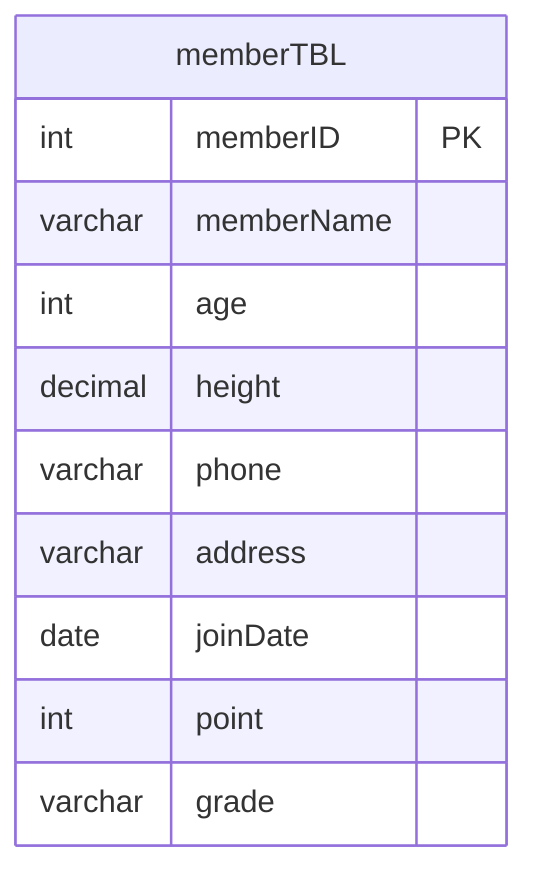
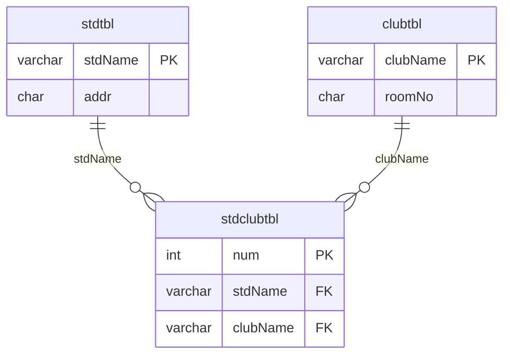
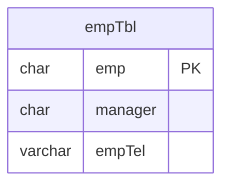
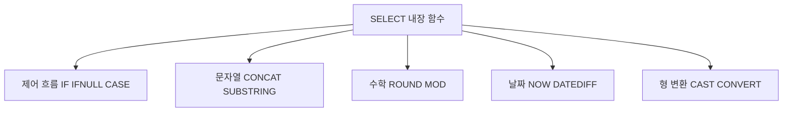
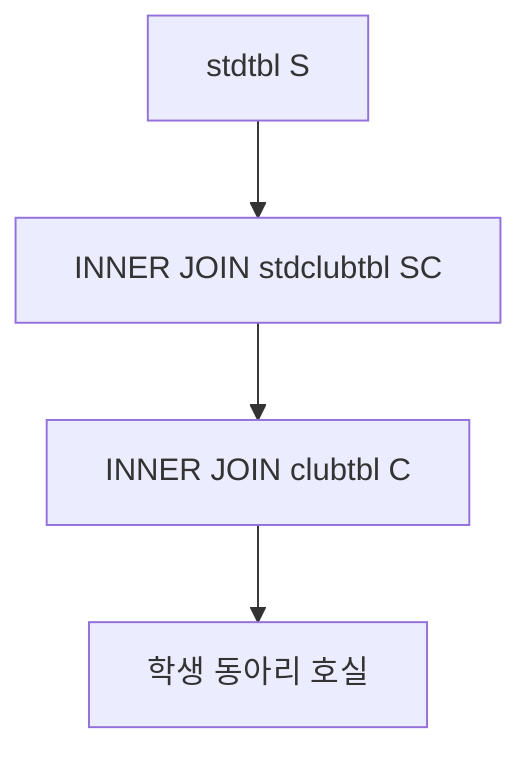
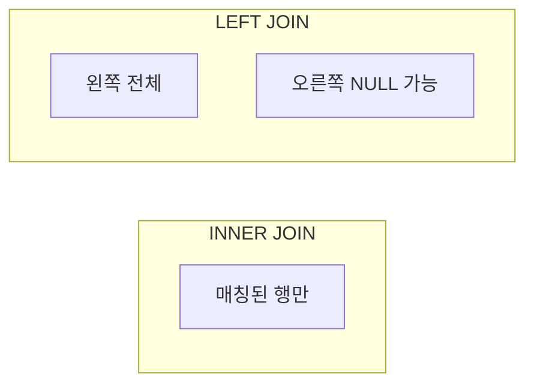
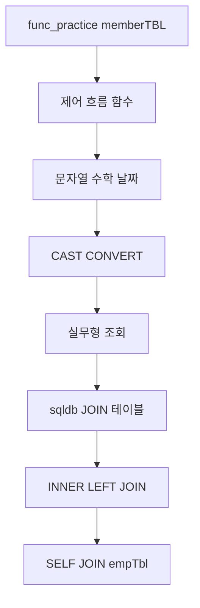

# DB04 - SQL 학습 가이드 (내장 함수 · JOIN)

> KB7-DB 커리큘럼: [db03](../db03/) 조회·집계 → **db04(현재)** 함수·JOIN → [JDBC](../README.md#3-jdbc-흐름)  
> 전체 개요: [README.md](../README.md)

## 📋 프로젝트 개요

이 프로젝트는 **MySQL 내장 함수**와 **JOIN(조인)** 을 중심으로 `SELECT` 결과를 가공·연결하는 방법을 학습하기 위한 자료입니다.

- **전제:** [db03](../db03/)에서 `SELECT` · `WHERE` · `GROUP BY` 기초를 익혔다고 가정합니다.
- **다음:** JDBC로 동일한 SQL을 Java에서 실행합니다.
- `func_practice` / `memberTBL` : 제어·문자열·수학·날짜·형 변환 함수 실습
- `sqldb` · `stdtbl` / `clubtbl` / `stdclubtbl` : **INNER JOIN** · **LEFT JOIN** (학생 ↔ 동아리 M:N)
- `empTbl` : **SELF JOIN** (조직도·직속 상사 조회)
- `day4.sql` : 함수 실습 → 다중 테이블 JOIN → 셀프 조인 쿼리 모음

---

## 🗂️ 사용 테이블 구조

### ERD — memberTBL (함수 실습용)



> `func_practice` DB를 `day4.sql` 상단에서 생성합니다. `height`는 `DECIMAL(5,1)` (전체 5자리, 소수 1자리).

### ERD — stdtbl · clubtbl · stdclubtbl (JOIN 실습, M:N)



> 한 학생이 여러 동아리에 가입할 수 있고, 한 동아리에 여러 학생이 속할 수 있는 **M:N** 구조입니다. 중간 테이블 `stdclubtbl` 로 연결합니다.

### ERD — empTbl (SELF JOIN)



> `manager` 컬럼이 같은 테이블의 `emp` 를 참조합니다. 별도 FK 없이 **같은 테이블을 두 번** 조인합니다.

### DB01 → DB04 학습 흐름


---

## 📊 테이블 정보 (day4.sql 기준)

### 1️⃣ memberTBL (회원 · func_practice)

| 컬럼명 | 설명 | day4.sql 예시 |
|--------|------|----------------|
| memberID | 회원 번호 (AUTO_INCREMENT) | PK |
| memberName | 이름 | `CONCAT(memberName, '님')` |
| age | 나이 | `CASE WHEN age < 20 ...` |
| height | 키 (DECIMAL) | `ROUND(height, 0)` |
| phone | 전화 (NULL 가능) | `IFNULL(phone, '미등록')` |
| address | 주소 | `SUBSTRING(address, 1, 2)` |
| joinDate | 가입일 | `DATEDIFF(CURDATE(), joinDate)` |
| point | 포인트 | `IF(point >= 3000, ...)` |
| grade | 등급 | `CONCAT_WS` 실습 |

### 2️⃣ stdtbl · clubtbl · stdclubtbl (학생·동아리)

| 테이블 | 컬럼 | 설명 |
|--------|------|------|
| stdtbl | stdName, addr | 학생·지역 |
| clubtbl | clubName, roomNo | 동아리·호실 |
| stdclubtbl | num, stdName, clubName | 가입 관계 (FK) |

### 3️⃣ empTbl (조직)

| 컬럼명 | 설명 | SELF JOIN |
|--------|------|-----------|
| emp | 사원명 | 조인 키 |
| manager | 직속 상사명 | `A.manager = B.emp` |
| empTel | 연락처 | 상사 연락처 조회 |

---

## 🔍 주요 SQL 주제

### 함수 분류 개요



---

### 1. 제어 흐름 함수

```sql
SELECT memberName, point,
       IF(point >= 3000, '우수회원', '일반회원') AS 회원구분
FROM memberTBL;

SELECT memberName, phone,
       IFNULL(phone, '전화번호 없음') AS phone_result
FROM memberTBL;

SELECT memberName, age,
       CASE
           WHEN age < 20 THEN '10대'
           WHEN age < 30 THEN '20대'
           WHEN age < 40 THEN '30대'
           ELSE '40대 이상'
       END AS age_group
FROM memberTBL;
```

| 함수 | 용도 |
|------|------|
| `IF(조건, 참, 거짓)` | 단순 분기 |
| `IFNULL(expr, 대체값)` | `NULL` 대체 |
| `CASE WHEN ... THEN ... END` | 다중 분기 |

---

### 2. 문자열 함수

```sql
SELECT memberName,
       CONCAT(memberName, '님') AS name_text,
       CONCAT_WS(' / ', memberName, address, grade) AS member_info
FROM memberTBL;

SELECT memberName,
       LEFT(phone, 3) AS phone_start,
       RIGHT(phone, 4) AS phone_end
FROM memberTBL
WHERE phone IS NOT NULL;

SELECT memberName,
       SUBSTRING(address, 1, 2) AS region,
       REPLACE(address, '서울', 'SEOUL') AS changed_address
FROM memberTBL;
```

| 함수 | 의미 |
|------|------|
| `CONCAT` | 문자열 연결 |
| `CONCAT_WS(구분자, ...)` | 구분자로 연결 |
| `LENGTH` / `CHAR_LENGTH` | 바이트·문자 길이 |
| `LEFT` / `RIGHT` / `SUBSTRING` | 부분 문자열 |
| `REPLACE` / `TRIM` | 치환·공백 제거 |

---

### 3. 수학 함수

```sql
SELECT memberName, height,
       ROUND(height, 0) AS rounded_height,
       CEIL(height) AS ceil_height,
       FLOOR(height) AS floor_height
FROM memberTBL;

SELECT memberName, point,
       MOD(point, 1000) AS point_remainder,
       SQRT(point) AS sqrt_point
FROM memberTBL;
```

| 함수 | 의미 |
|------|------|
| `ROUND`, `CEIL`, `FLOOR` | 반올림·올림·내림 |
| `MOD` | 나머지 |
| `ABS`, `POW`, `SQRT`, `SIGN`, `RAND` | 절대값·거듭제곱·제곱근 등 |

---

### 4. 날짜·시간 함수

```sql
SELECT CURDATE() AS today, NOW() AS now_time;

SELECT memberName, joinDate,
       DATEDIFF(CURDATE(), joinDate) AS 가입후_지난일수
FROM memberTBL;

SELECT memberName, joinDate,
       DATE_ADD(joinDate, INTERVAL 100 DAY) AS 가입_100일후,
       YEAR(joinDate) AS 가입연도,
       MONTH(joinDate) AS 가입월,
       DAY(joinDate) AS 가입일
FROM memberTBL;
```

| 함수 | 의미 |
|------|------|
| `CURDATE`, `CURTIME`, `NOW`, `SYSDATE` | 현재 날짜·시간 |
| `DATEDIFF` | 두 날짜 차이(일) |
| `DATE_ADD` / `DATE_SUB` | 날짜 더하기·빼기 |
| `YEAR` / `MONTH` / `DAY` | 날짜 분해 |
| `LAST_DAY` | 해당 월 마지막 날 |

---

### 5. 형 변환 함수

```sql
SELECT CAST('2025-05-20' AS DATE) AS cast_date,
       CAST('12345' AS UNSIGNED) AS cast_number;

SELECT CONVERT('2025-05-20', DATE) AS convert_date,
       CONVERT(12345, CHAR) AS convert_char;
```

| 함수 | 용도 |
|------|------|
| `CAST(expr AS type)` | ANSI 표준 형 변환 |
| `CONVERT(expr, type)` | MySQL 형 변환 |

---

### 6. 실무형 조회 (함수 조합)

```sql
SELECT memberName, grade, point,
       CASE
           WHEN point >= 7000 THEN '최우수 고객'
           WHEN point >= 3000 THEN '우수 고객'
           WHEN point >= 1000 THEN '일반 고객'
           ELSE '신규 고객'
       END AS customer_level
FROM memberTBL
ORDER BY point DESC;

SELECT memberName,
       IFNULL(phone, '미등록') AS phone,
       CONCAT(SUBSTRING(address, 1, 2), ' 지역 회원') AS region_label,
       DATEDIFF(CURDATE(), joinDate) AS active_days
FROM memberTBL
ORDER BY active_days DESC;
```

---

### 7. JOIN — INNER · LEFT



**2테이블 INNER JOIN**

```sql
SELECT S.stdName, addr, clubName
FROM stdtbl S
INNER JOIN stdclubtbl SC ON S.stdName = SC.stdName;
```

**3테이블 INNER JOIN**

```sql
SELECT S.stdName, addr, C.clubName, roomNo
FROM stdtbl S
INNER JOIN stdclubtbl SC ON S.stdName = SC.stdName
INNER JOIN clubtbl C ON SC.clubName = C.clubName
ORDER BY S.stdName
LIMIT 3;
```

**LEFT JOIN** (오른쪽 테이블에 매칭 없으면 NULL)

```sql
SELECT SC.num, SC.stdName, SC.clubName, C.roomNo
FROM stdclubtbl SC
LEFT JOIN clubtbl C ON SC.clubName = C.clubName;
```

| JOIN 종류 | 설명 |
|-----------|------|
| **INNER JOIN** | 양쪽 모두 매칭되는 행만 |
| **LEFT JOIN** | 왼쪽 전체 + 오른쪽 매칭(없으면 NULL) |



---

### 8. SELF JOIN

같은 테이블을 **별칭(A, B)** 으로 두 번 참조합니다.


```sql
SELECT A.emp AS 부하직원,
       B.emp AS 직속상관,
       B.empTel AS 직속상관연락처
FROM empTbl A
INNER JOIN empTbl B ON A.manager = B.emp
WHERE A.emp = '우대리';
```

> 조직도·계층 구조처럼 **자기 자신을 참조**하는 데이터에 사용합니다.

---

## 📝 학습 목표

✅ `IF` · `IFNULL` · `CASE` 로 조회 결과 분기·NULL 처리  
✅ 문자열·수학·날짜 **내장 함수**로 컬럼 가공  
✅ `CAST` / `CONVERT` 형 변환  
✅ **INNER JOIN** 으로 2·3개 테이블 연결  
✅ **LEFT JOIN** 과 INNER 차이 이해  
✅ **SELF JOIN** 으로 상하 관계 조회  
✅ 함수와 JOIN을 조합한 실무형 `SELECT` 작성  

---

## 🚀 실행 방법

1. **함수 실습** — `day4.sql` **상단**부터 실행합니다.
   ```sql
   -- func_practice DB + memberTBL 생성·INSERT 후
   -- 섹션 1~6 쿼리 순서대로 실행
   ```
2. **JOIN 실습** — `USE sqldb;` 이후 `stdtbl` · `clubtbl` · `stdclubtbl` DDL/DML 실행
3. **SELF JOIN** — `empTbl` 생성·INSERT 후 조인 쿼리 실행
4. 함수·JOIN 구문은 **부분만 먼저** 실행해 결과를 확인합니다.

### 실행 흐름



### day4.sql — 권장 실행 구간

| 구간 | 내용 |
|------|------|
| 1~183행 (또는 중복 전 반복 구간) | `func_practice` · 내장 함수 · 실무 예제 |
| JOIN 섹션 | `stdtbl` / `clubtbl` / `stdclubtbl` · INNER/LEFT |
| SELF JOIN 섹션 | `empTbl` · 직속 상사 조회 |

> `day4.sql` 에 동일한 함수 실습 블록이 **두 번** 들어 있습니다. 한 번만 실행하거나, 재실습 시 `DROP DATABASE func_practice` 후 다시 진행하세요.  
> `empTbl` 구간은 스크립트에 `emptbl` / `empTbl` 표기가 섞여 있으므로, 오류 시 테이블명·대소문자를 Workbench에서 확인하세요.

---

## 📁 파일 구성

| 파일 | 설명 |
|------|------|
| `day4.sql` | 내장 함수, JOIN(INNER/LEFT), SELF JOIN 실습 |

---

## 📐 다이어그램 요약 (Mermaid)

| 다이어그램 | 유형 | 설명 |
|-----------|------|------|
| memberTBL | `erDiagram` | 함수 실습 단일 테이블 |
| stdtbl ↔ stdclubtbl ↔ clubtbl | `erDiagram` | M:N JOIN 구조 |
| empTbl | `erDiagram` | SELF JOIN 조직 |
| DB01→DB04 | `flowchart` | 단계별 학습 경로 |
| 함수 분류 | `flowchart` | 제어·문자열·수학·날짜·형변환 |
| INNER JOIN | `flowchart` | 3테이블 조인 흐름 |
| INNER vs LEFT | `flowchart` | 조인 종류 비교 |
| SELF JOIN | `flowchart` | A.manager = B.emp |
| 실행 흐름 | `flowchart` | day4 학습 순서 |

---

<br>


<br>
- datatype <br>


- 함수 <br>


- join <Br>


