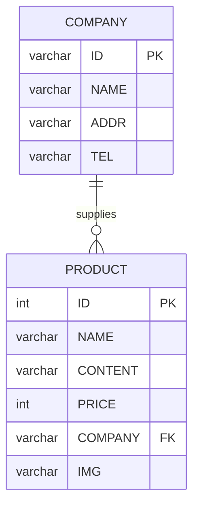
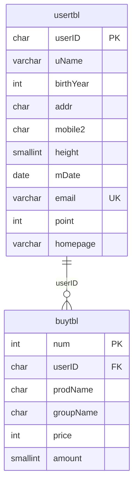
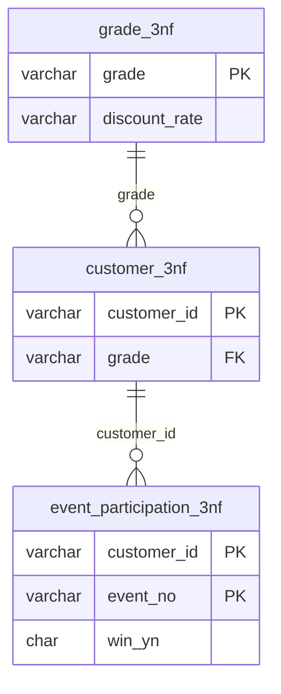
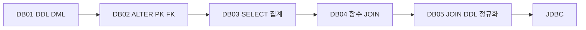
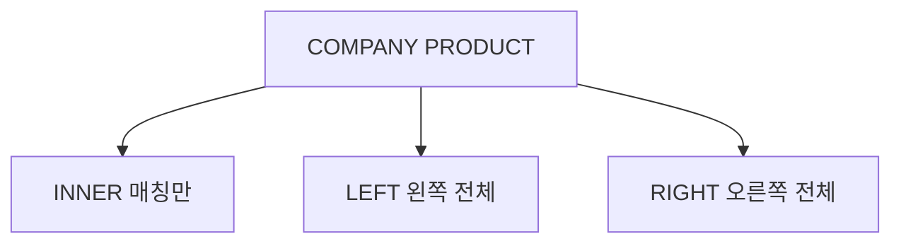
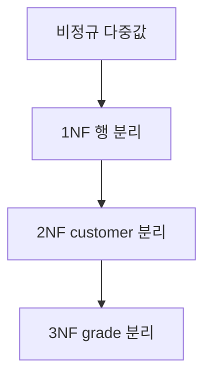
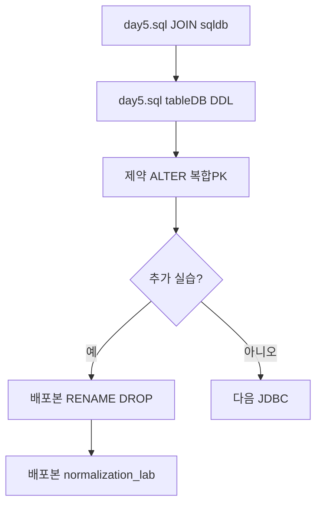

# DB05 - SQL 학습 가이드 (JOIN 복습 · DDL 심화 · 정규화)

> KB7-DB 커리큘럼: [db04](../db04/) 함수·JOIN → **db05(현재)** JOIN 복습 · DDL 제약·ALTER → [JDBC](../README.md#3-jdbc-흐름)  
> 전체 개요: [README.md](../README.md)

## 📋 프로젝트 개요

이 프로젝트는 **JOIN 복습**과 **DDL 심화**(FK·제약조건·`ALTER TABLE`·복합 PK), **정규화(1NF~3NF)** 를 중심으로 테이블 설계와 무결성을 학습하기 위한 자료입니다.

- **전제:** [db04](../db04/)에서 INNER/LEFT JOIN과 기본 DDL을 익혔다고 가정합니다.
- **다음:** JDBC로 동일한 SQL을 Java에서 실행합니다.

### 파일 역할

| 파일 | 용도 | 포함 범위 |
|------|------|-----------|
| **`day5.sql`** | 수업 중 메인 실습 | JOIN 복습(`sqldb`) → `tableDB` DDL·FK·UNIQUE/CHECK/DEFAULT·ALTER·복합 PK · `SHOW INDEX` |
| **`day5_수업전배포.sql`** | 수업 전·후 자율 실습 | 위 내용 + **RENAME/TRUNCATE/DROP** · **`normalization_lab` 정규화** |

> 이전 저장소의 `day5.sql`은 `-- ddl` 한 줄만 있었습니다. 현재는 **JOIN 복습부터 DDL 전 구간**이 들어 있으며, 정규화·객체 삭제 실습은 **배포본**에서 진행합니다.

### 사용 DB·테이블

- `sqldb` · `COMPANY` / `PRODUCT` : **INNER · LEFT · RIGHT JOIN** (1:N, FK, `COMPANY` NULL 상품)
- `tableDB` · `usertbl` / `buytbl` : **FK** · **UNIQUE** · **CHECK** · **DEFAULT** · **ALTER TABLE** · **복합 PRIMARY KEY**
- `normalization_lab` (`day5_수업전배포.sql`만) : 비정규 → **1NF · 2NF · 3NF**

---

## 🗂️ 사용 테이블 구조

### ERD — COMPANY · PRODUCT (JOIN 복습, 1:N)



> `PRODUCT.COMPANY` → `COMPANY.ID`. `COMPANY`가 `NULL`인 상품(110, 111)이 있어 **RIGHT JOIN**·**LEFT JOIN** 차이를 확인할 수 있습니다.

### ERD — usertbl · buytbl (DDL·제약 실습)



> `buytbl.userID` → `usertbl.userID`. 수업 중 `ALTER`로 `email`(UNIQUE), `point`(DEFAULT), `homepage` 추가·`name` → `uName` 변경·`mobile1` 삭제가 이루어집니다.

### ERD — 정규화 실습 (3NF, 배포본)



### DB01 → DB05 학습 흐름



---

## 📊 테이블 정보

### 1️⃣ COMPANY · PRODUCT (`sqldb`, 두 파일 공통)

| 컬럼 (PRODUCT) | 설명 | JOIN 키 |
|----------------|------|---------|
| ID | 상품 번호 | PK |
| NAME, CONTENT, PRICE, IMG | 상품 정보 | — |
| COMPANY | 제조사 ID | `P.company = C.id` (FK, NULL 가능) |

| 컬럼 (COMPANY) | 설명 |
|----------------|------|
| ID | 회사 코드 (PK) |
| NAME, ADDR, TEL | 회사 정보 |

**day5.sql** — 소문자 별칭·백틱 별칭:

```sql
DESC company;
DESC product;
SELECT * FROM company;
SELECT * FROM product;
```

**day5_수업전배포.sql** — 대문자 테이블명·`OUTER` 키워드 명시:

```sql
SELECT P.ID AS Product_ID, P.NAME AS Product_Name, C.NAME AS Company_Name
FROM PRODUCT P
INNER JOIN COMPANY C ON P.COMPANY = C.ID;
-- LEFT OUTER JOIN / RIGHT OUTER JOIN 동일 패턴
```

### 2️⃣ usertbl · buytbl (`tableDB`)

| 테이블 | 주요 컬럼 | 제약·특징 |
|--------|-----------|-----------|
| usertbl | userID, name→**uName**, height, email | PK, UNIQUE(email), CHECK(height≥100), DEFAULT(point) |
| buytbl | num(AUTO_INCREMENT), userID, prodName, price, amount | PK, FK → usertbl |

| 파일 | FK 정의 차이 |
|------|----------------|
| `day5.sql` | `FOREIGN KEY (userID) REFERENCES usertbl(userID)` |
| `day5_수업전배포.sql` | `CONSTRAINT FK_buytbl_usertbl FOREIGN KEY(userID) ...` |

### 3️⃣ prodtbl (복합 PK)

| 컬럼명 | 설명 |
|--------|------|
| prodCode, prodID | **복합 PRIMARY KEY** (`CONSTRAINT PK_prodtbl`) |
| prodDate | 등록 일시 |
| prodCur | 현재 상태 (배포본에서 `producttbl.status`로 RENAME) |

---

## 🔍 주요 SQL 주제

### JOIN 복습



**INNER JOIN** (`day5.sql`)

```sql
SELECT P.id AS pid, P.name AS pname, C.name AS `c name`
FROM product P
INNER JOIN company C ON C.id = P.company;
```

**LEFT · RIGHT JOIN**

```sql
-- 회사 기준: 상품 없는 회사도 표시
SELECT C.name AS `c name`, C.tel, P.id AS pid, P.name AS pname
FROM company C
LEFT JOIN product P ON C.id = P.company;

-- 상품 기준: COMPANY가 NULL인 행도 표시
SELECT P.id AS pid, P.name AS pname, C.name AS `c name`, C.tel
FROM company C
RIGHT JOIN product P ON C.id = P.company;
```

| JOIN | 결과 특징 |
|------|-----------|
| **INNER** | 양쪽 키가 모두 매칭된 행만 |
| **LEFT** | 왼쪽(`company`) 전체, 오른쪽 없으면 NULL |
| **RIGHT** | 오른쪽(`product`) 전체, 왼쪽 없으면 NULL |

---

### FOREIGN KEY · JOIN (`tableDB`)

```sql
-- FK 위반 (존재하지 않는 userID 'AAA') → Error 1452
INSERT INTO buytbl VALUES (NULL, 'AAA', '운동화', NULL, 30, 2);

-- FK 만족
INSERT INTO buytbl VALUES (NULL, 'KKH', '운동화', NULL, 30, 2);

SELECT U.*, B.*
FROM usertbl U
INNER JOIN buytbl B ON U.userID = B.userID;
```

> `num`은 AUTO_INCREMENT이므로 `NULL`을 넣어도 번호는 생성되지만, **FK가 맞지 않으면** 행 전체가 거부됩니다.

---

### UNIQUE · CHECK · DEFAULT

```sql
ALTER TABLE usertbl ADD email VARCHAR(30) UNIQUE;

UPDATE usertbl SET email = 'aaa@email.com' WHERE userId = 'LSG';
-- 동일 email을 KBS에도 넣으면 → Error 1062

ALTER TABLE usertbl ADD CONSTRAINT CK_height CHECK (height >= 100);
ALTER TABLE usertbl ADD point INT DEFAULT 0;
```

| 제약 | day5.sql 예시 오류 |
|------|---------------------|
| **UNIQUE** | Duplicate entry `aaa@email.com` |
| **CHECK** | height 50 삽입 실패 |
| **DEFAULT** | `point` 미입력 시 0 |

---

### ALTER TABLE

```sql
ALTER TABLE usertbl ADD homepage VARCHAR(30) DEFAULT 'http://www.naver.com';
ALTER TABLE usertbl MODIFY homepage VARCHAR(50);
ALTER TABLE usertbl CHANGE COLUMN name uName VARCHAR(20) NULL;
ALTER TABLE usertbl DROP COLUMN mobile1;
```

---

### 복합 PRIMARY KEY · 메타 조회 (`day5.sql` 말미)

```sql
CREATE TABLE prodtbl (
    prodCode CHAR(3) NOT NULL,
    prodID CHAR(4) NOT NULL,
    prodDate DATETIME NOT NULL,
    prodCur CHAR(10) NULL,
    CONSTRAINT PK_prodtbl PRIMARY KEY (prodCode, prodID)
);

SHOW DATABASES;
SHOW TABLES;
SHOW INDEX FROM prodtbl;
```

---

### RENAME · TRUNCATE · DROP (`day5_수업전배포.sql`만)

```sql
RENAME TABLE prodtbl TO producttbl;
ALTER TABLE producttbl RENAME COLUMN prodCur TO status;
TRUNCATE TABLE producttbl;

DROP TABLE IF EXISTS buytbl;   -- FK 자식 먼저
DROP TABLE IF EXISTS usertbl;
DROP DATABASE IF EXISTS tableDB;
```

배포본 상단에는 테이블 이름 변경 예제도 있습니다.

```sql
CREATE TABLE p (pid INT);
RENAME TABLE p TO p2;
```

---

### 정규화 1NF · 2NF · 3NF (`day5_수업전배포.sql`만)



**1NF** — `E001,E005` 같은 다중값을 행으로 분리. 갱신 이상은 `UPDATE ... WHERE customer_id='apple'` 실습으로 확인.

**2NF** — `customer_2nf` + `event_participation_2nf` (부분 함수 종속 제거)

**3NF** — `grade_3nf` + `customer_3nf` + `event_participation_3nf`

```sql
SELECT c.customer_id, e.event_no, e.win_yn, c.grade, g.discount_rate
FROM customer_3nf c
JOIN event_participation_3nf e ON c.customer_id = e.customer_id
JOIN grade_3nf g ON c.grade = g.grade;
```

| 정규형 | 핵심 |
|--------|------|
| **1NF** | 원자값, 반복 제거 |
| **2NF** | 복합키의 부분 함수 종속 제거 |
| **3NF** | 이행적 함수 종속 제거 |

---

### SELECT vs DML 결과 (`day5.sql` 235~238행)

| 구문 | Workbench 결과 |
|------|----------------|
| `SELECT` | 컬럼명 + 데이터 행 |
| `INSERT` / `UPDATE` / `DELETE` | 영향 받은 **행 수(정수)** |

---

## 📝 학습 목표

✅ `DESC` · `SELECT *`로 테이블 구조·데이터 확인 후 JOIN 작성  
✅ INNER · LEFT · RIGHT JOIN 차이 (COMPANY/PRODUCT)  
✅ **FOREIGN KEY** 참조 무결성 (오류 1452 / 성공 케이스)  
✅ **UNIQUE** · **CHECK** · **DEFAULT** 제약  
✅ **ALTER TABLE** (`ADD` / `MODIFY` / `CHANGE` / `DROP`)  
✅ **복합 PRIMARY KEY** · `SHOW INDEX`  
✅ (배포본) `RENAME` · `TRUNCATE` · `DROP`  
✅ (배포본) **1NF · 2NF · 3NF** 분리와 갱신 이상 이해  

---

## 🚀 실행 방법

### 권장 순서

1. **`day5.sql`** — 상단(`USE sqldb`)부터 순서대로 실행 (수업 메인)
2. **`day5_수업전배포.sql`** — 수업 전 예습 또는 수업 후 **11~14절·정규화** 구간만 추가 실행



### `day5.sql` — 실행 구간 (263행)

| 행 | 내용 |
|----|------|
| 1~69 | `sqldb` · COMPANY/PRODUCT · `DESC` · INNER/LEFT/RIGHT JOIN |
| 71~147 | `tableDB` · usertbl/buytbl · FK 오류·성공 · INNER JOIN |
| 149~231 | UNIQUE · CHECK · DEFAULT · ALTER |
| 235~238 | SELECT vs DML 결과 형태 (주석) |
| 240~258 | 복합 PK · `SHOW INDEX` |
| 260~262 | `USE mysql` · `SHOW TABLES` (시스템 DB 탐색, 선택) |

### `day5_수업전배포.sql` — 추가 구간 (483행)

| 행 | 내용 |
|----|------|
| 1~66 | JOIN 확인(대문자 테이블·OUTER) · `RENAME TABLE p` 예제 |
| 69~254 | `tableDB` DDL 전체(섹션 1~10, 명명 FK) |
| 256~286 | RENAME · TRUNCATE · DROP · `DROP DATABASE tableDB` |
| 290~482 | `normalization_lab` · 1NF → 2NF → 3NF |

### 주의 사항

- `sqldb`에 `COMPANY`/`PRODUCT`가 이미 있으면 `CREATE TABLE`이 실패합니다. 재실습 시 `DROP TABLE` 후 진행하세요.
- Windows MySQL은 테이블명 대소문자 처리가 설정마다 다릅니다. `company` / `COMPANY` 혼용 시 Workbench에서 실제 이름을 확인하세요.
- 두 파일의 **`tableDB` 블록은 중복**입니다. 연속 실행 시 `DROP DATABASE tableDB` 후 한 파일만 사용하거나, 배포본은 **정규화 구간만** 실행하세요.
- 배포본 286행에서 `tableDB`를 삭제한 뒤 290행부터 `normalization_lab`을 만듭니다. 정규화만 보려면 290행부터 실행해도 됩니다.

---

## 📁 파일 구성

| 파일 | 설명 |
|------|------|
| `day5.sql` | 수업 메인: JOIN 복습 + DDL·제약·ALTER·복합 PK (263행) |
| `day5_수업전배포.sql` | 수업 전 배포: JOIN 확인, DDL 전체, RENAME/TRUNCATE/DROP, 정규화 (483행) |
| `README.md` | 학습 가이드 (현재 문서) |

---

## 📐 다이어그램 요약 (Mermaid)

| 다이어그램 | 유형 | 설명 |
|-----------|------|------|
| COMPANY ↔ PRODUCT | `erDiagram` | 1:N JOIN |
| usertbl ↔ buytbl | `erDiagram` | FK·제약 |
| grade · customer · event | `erDiagram` | 3NF (배포본) |
| DB01→DB05 | `flowchart` | 커리큘럼 |
| JOIN 종류 | `flowchart` | INNER/LEFT/RIGHT |
| 정규화 | `flowchart` | 1NF→3NF |
| 실행 흐름 | `flowchart` | day5 → 배포본 선택 |
