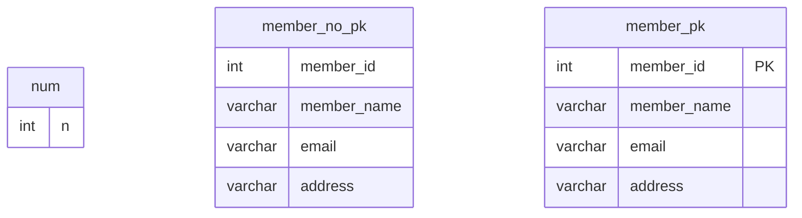
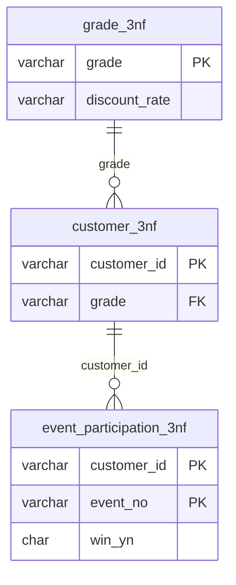
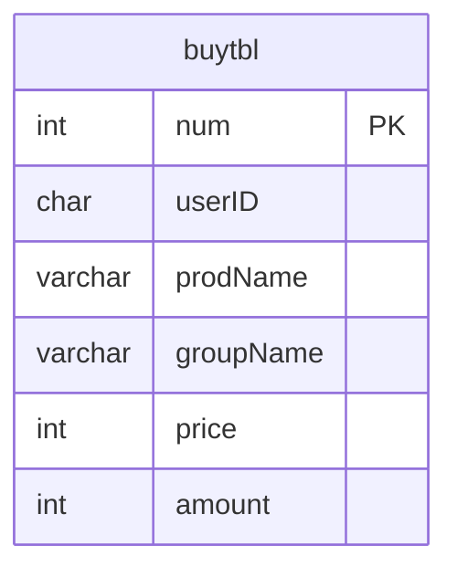
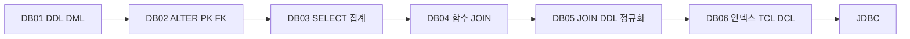
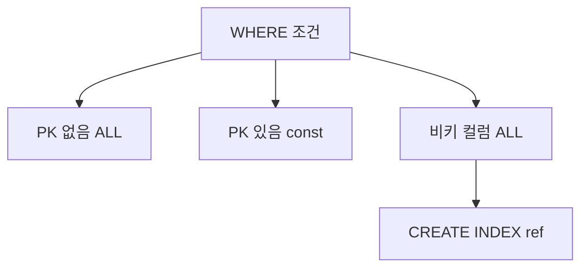
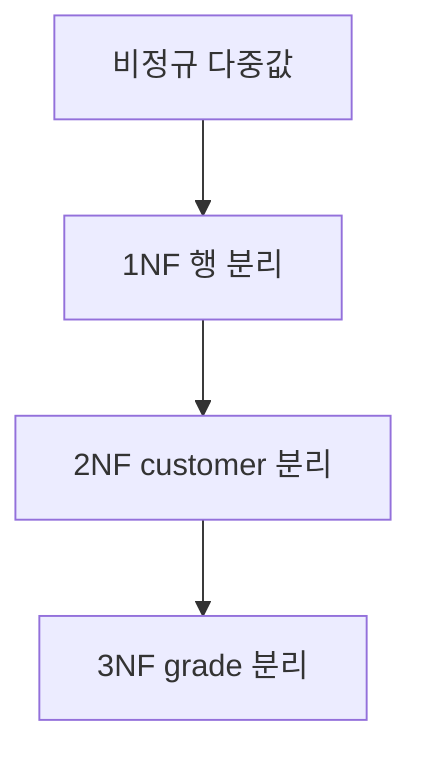
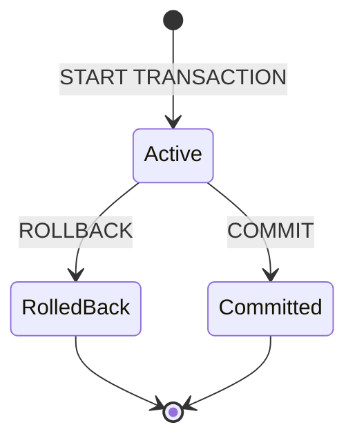
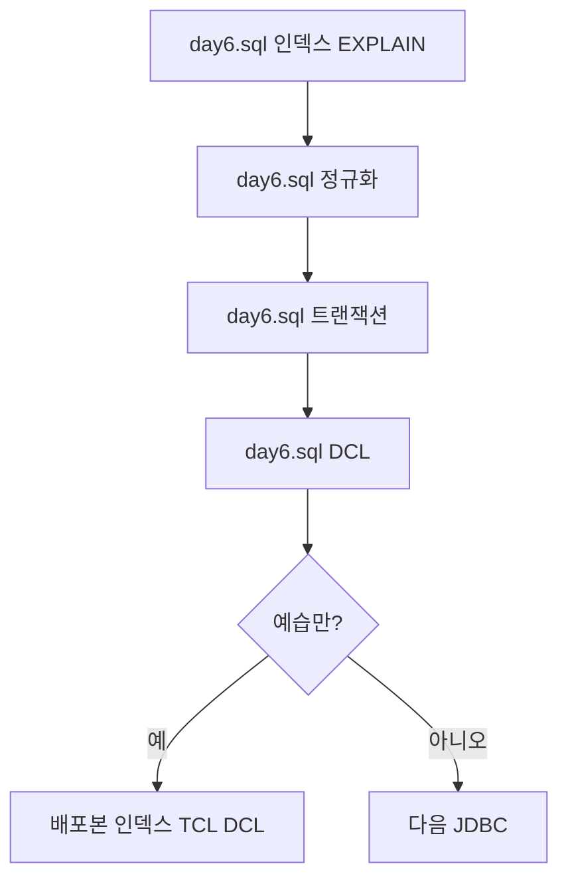

# DB06 - SQL 학습 가이드 (인덱스 · 정규화 · 트랜잭션 · DCL)

> KB7-DB 커리큘럼: [db05](../db05/) JOIN·DDL·정규화 → **db06(현재)** 인덱스·`EXPLAIN` · 정규화 복습 · TCL · DCL → [JDBC](../README.md#3-jdbc-흐름)  
> 전체 개요: [README.md](../README.md)

## 📋 프로젝트 개요

이 프로젝트는 **인덱스(PK·보조 인덱스)** 와 **`EXPLAIN` 실행 계획**, **정규화(1NF~3NF) 복습**, **트랜잭션(TCL)**, **사용자·권한(DCL)** 을 중심으로 조회 성능·데이터 무결성·권한 제어를 학습하기 위한 자료입니다.

- **전제:** [db05](../db05/)에서 DDL·FK·제약·정규화 개념을 익혔다고 가정합니다.
- **다음:** JDBC로 동일한 SQL을 Java에서 실행합니다.

### 파일 역할

| 파일 | 용도 | 포함 범위 |
|------|------|-----------|
| **`day6.sql`** | 수업 중 메인 실습 | `index_test_simple` 인덱스·`EXPLAIN` → `normalization_lab` 1NF~3NF → `SQLDB` 트랜잭션 → DCL(`testuser`) |
| **`day6-사전배포.sql`** | 수업 전·후 자율 실습 | 인덱스·트랜잭션·DCL (정규화 구간 없음, DCL 단계별 `SHOW GRANTS` 상세) |

> **배포본**은 인덱스·TCL·DCL 예습용입니다. **정규화 전 구간**은 `day6.sql`에서 진행합니다. db05 배포본과 `normalization_lab` 내용이 겹치므로, 정규화는 한쪽만 깊게 복습해도 됩니다.

### 사용 DB·테이블

- `index_test_simple` · `num` / `member_no_pk` / `member_pk` : **PK 유무** · **보조 인덱스** · `EXPLAIN` (약 10만 행)
- `normalization_lab` (`day6.sql`만) : 비정규 → **1NF · 2NF · 3NF**
- `SQLDB` · `buytbl` : **`START TRANSACTION`** · **`ROLLBACK`** · **`COMMIT`**
- `sqldb` (DCL) : **`CREATE USER`** · **`GRANT`** · **`REVOKE`** · **`DROP USER`**

---

## 🗂️ 사용 테이블 구조

### ERD — 인덱스 실습 (`index_test_simple`)



> `member_no_pk`는 PK 없음 → `member_id` 조건 시 **Full Table Scan(`type=ALL`)**.  
> `member_pk`는 PK 인덱스 → `member_id` 조건 시 **`const` + PRIMARY**.  
> `email` 검색은 **`CREATE INDEX idx_member_email`** 후 **`ref`** 로 개선.

### ERD — 정규화 실습 (3NF, `day6.sql`)



### ERD — 트랜잭션 실습 (`SQLDB` · `buytbl`)



### DB01 → DB06 학습 흐름



---

## 📊 테이블 정보

### 1️⃣ 인덱스 실습 (`index_test_simple`)

| 테이블 | PK | 용도 |
|--------|-----|------|
| `num` | 없음 | 0~9 숫자, `CROSS JOIN` 5회로 10만 행 생성 |
| `member_no_pk` | 없음 | PK 없을 때 `EXPLAIN` 비교 |
| `member_pk` | `member_id` | PK·보조 인덱스(`idx_member_email`) 비교 |

대량 INSERT 패턴 (`day6.sql`):

```sql
INSERT INTO member_no_pk (member_id, member_name, email, address)
SELECT
    a.n * 10000 + b.n * 1000 + c.n * 100 + d.n * 10 + e.n + 1,
    CONCAT('회원', ...),
    CONCAT('user', ..., '@test.com'),
    CASE WHEN e.n IN (0, 1) THEN '서울' ... END
FROM num a
CROSS JOIN num b
CROSS JOIN num c
CROSS JOIN num d
CROSS JOIN num e;
```

| `EXPLAIN` 대상 | `type` (대략) | 의미 |
|----------------|---------------|------|
| `member_no_pk` · `member_id = 90000` | `ALL` | 전체 스캔 |
| `member_pk` · `member_id = 90000` | `const` | PK로 즉시 탐색 |
| `member_pk` · `email = '...'` (인덱스 전) | `ALL` | PK 있어도 비키 컬럼은 느릴 수 있음 |
| `member_pk` · `email = '...'` (인덱스 후) | `ref` | 보조 인덱스 사용 |

```sql
ANALYZE TABLE member_pk;

CREATE INDEX idx_member_email ON member_pk(email);

EXPLAIN SELECT * FROM member_pk WHERE email = 'user90000@test.com';
```

---

### 2️⃣ 정규화 (`normalization_lab`, `day6.sql`만)

| 단계 | 테이블 | 핵심 |
|------|--------|------|
| 비정규 | `event_participation_unnormalized` | 한 칸에 `E001,E005` 등 다중값 |
| **1NF** | `event_participation_1nf` | 행 분리, 갱신 이상(`UPDATE apple` 일부만) |
| **2NF** | `customer_2nf` + `event_participation_2nf` | `grade`·`discount_rate` 분리 |
| **3NF** | `grade_3nf` + `customer_3nf` + `event_participation_3nf` | `grade` → `discount_rate` 이행 종속 제거 |

```sql
SELECT c.customer_id, e.event_no, e.win_yn, c.grade, g.discount_rate
FROM customer_3nf c
JOIN event_participation_3nf e ON c.customer_id = e.customer_id
JOIN grade_3nf g ON c.grade = g.grade;
```

---

### 3️⃣ 트랜잭션 (`SQLDB` · `buytbl`)

| 컬럼 | 설명 |
|------|------|
| `num` | `AUTO_INCREMENT` PK |
| `userID`, `prodName`, `groupName`, `price`, `amount` | 구매 데이터 |

```sql
START TRANSACTION;
DELETE FROM buytbl WHERE num = 1;
DELETE FROM buytbl WHERE num = 2;
SELECT * FROM buytbl;   -- 삭제된 상태 확인
ROLLBACK;              -- 실습 -1: 취소

START TRANSACTION;
DELETE FROM buytbl WHERE num = 1;
DELETE FROM buytbl WHERE num = 2;
COMMIT;                -- 실습 -2: 반영
```

> `SELECT @@autocommit;` — 기본값 `1`이면 문장마다 자동 커밋. 여러 DML을 묶을 때 `START TRANSACTION` 사용.

---

### 4️⃣ DCL (`testuser`@`localhost`)

| 단계 | 명령 | 설명 |
|------|------|------|
| 생성 | `CREATE USER ... IDENTIFIED BY` | 로컬 접속 계정 |
| 접속만 | `GRANT USAGE ON *.*` | DB 작업 권한 거의 없음 |
| 권한 부여 | `GRANT SELECT, INSERT, UPDATE ON sqldb.*` | 스키마 단위 권한 |
| 회수 | `REVOKE ... ON sqldb.*` | 부여 권한 제거 |
| 삭제 | `DROP USER` | 계정 제거 |

**`day6.sql`** — 한 번에 SELECT·INSERT·UPDATE 부여 후 일괄 `REVOKE`:

```sql
GRANT SELECT, INSERT, UPDATE ON sqldb.* TO 'testuser'@'localhost';
REVOKE SELECT, INSERT, UPDATE ON sqldb.* FROM 'testuser'@'localhost';
```

**`day6-사전배포.sql`** — 단계마다 `SHOW GRANTS`, `REVOKE UPDATE`만 먼저 회수하는 흐름.

---

## 🔍 주요 SQL 주제

### 인덱스 · `EXPLAIN`



| 구분 | 요약 |
|------|------|
| **PK 없음** | 기준 인덱스 없음 → 전체 행 스캔 |
| **PK 있음** | B+Tree로 `member_id` 빠른 탐색 |
| **보조 인덱스** | `email` 등 자주 검색하는 컬럼에 `CREATE INDEX` |

---

### 정규화 1NF · 2NF · 3NF (`day6.sql`)



| 정규형 | 핵심 |
|--------|------|
| **1NF** | 원자값, 반복 제거 · 갱신 이상 실습 |
| **2NF** | 복합키의 부분 함수 종속 제거 |
| **3NF** | 이행적 함수 종속 제거 |

---

### 트랜잭션(TCL)



| 명령 | 효과 |
|------|------|
| `START TRANSACTION` | 이후 DML을 하나의 작업 단위로 묶기 |
| `ROLLBACK` | 트랜잭션 내 변경 취소 |
| `COMMIT` | 변경 영구 반영 |

---

### DCL (사용자·권한)


> DCL은 **root 또는 `CREATE USER` 권한** 계정으로 실행합니다. 실습 비밀번호(`Test1234!`)는 로컬 전용 예시입니다.

---

## 📝 학습 목표

✅ `CROSS JOIN`으로 대량 데이터 생성 · `ANALYZE TABLE`  
✅ PK 유무·보조 인덱스에 따른 **`EXPLAIN` `type`** 차이 (`ALL` / `const` / `ref`)  
✅ **1NF · 2NF · 3NF** 분리와 갱신 이상 이해 (복습)  
✅ **`START TRANSACTION`** · **`ROLLBACK`** · **`COMMIT`**  
✅ **`CREATE USER`** · **`GRANT`** · **`REVOKE`** · **`SHOW GRANTS`** · **`DROP USER`**  

---

## 🚀 실행 방법

### 권장 순서

1. **`day6.sql`** — 상단(`index_test_simple`)부터 순서대로 실행 (수업 메인)
2. **`day6-사전배포.sql`** — 수업 전 인덱스·TCL·DCL 예습, 또는 DCL 단계별 확인



### `day6.sql` — 실행 구간 (484행)

| 행 | 내용 |
|----|------|
| 1~172 | `index_test_simple` · `num` · 10만 행 · `EXPLAIN` · 보조 인덱스 |
| 174~371 | `normalization_lab` · 비정규 → 1NF → 2NF → 3NF |
| 373~446 | `SQLDB` · `buytbl` · 트랜잭션 -1(`ROLLBACK`) · -2(`COMMIT`) · `@@autocommit` |
| 448~479 | DCL · `testuser` 생성·권한·회수·삭제 |

### `day6-사전배포.sql` — 실행 구간 (300행)

| 행 | 내용 |
|----|------|
| 1~162 | `index_test_simple` (정규화 없음) |
| 164~232 | `SQLDB` 트랜잭션 |
| 235~300 | DCL 단계별 `SHOW GRANTS` · `REVOKE UPDATE` 분리 |

### 주의 사항

- 인덱스 실습 INSERT는 **수 분** 걸릴 수 있습니다. Workbench에서 구간별 실행을 권장합니다.
- `index_test_simple`을 다시 만들려면 상단 `DROP DATABASE`부터 실행하세요.
- `day6.sql`과 **배포본**의 인덱스·`SQLDB`·DCL 블록은 **중복**입니다. 연속 실행 시 한 파일만 쓰거나, 배포본은 **DCL 상세 구간만** 추가 실행하세요.
- DCL의 `testuser`는 이미 있으면 `DROP USER IF EXISTS` 후 진행합니다.
- 정규화는 [db05/day5_수업전배포.sql](../db05/day5_수업전배포.sql)과 유사합니다. 시간이 부족하면 db06에서는 **인덱스·TCL·DCL**만 집중해도 됩니다.

---

## 📁 파일 구성

| 파일 | 설명 |
|------|------|
| `day6.sql` | 수업 메인: 인덱스·`EXPLAIN` · 정규화 · 트랜잭션 · DCL (484행) |
| `day6-사전배포.sql` | 사전 배포: 인덱스 · 트랜잭션 · DCL 상세 (300행) |
| `README.md` | 학습 가이드 (현재 문서) |

---

## 📐 다이어그램 요약 (Mermaid)

| 다이어그램 | 유형 | 설명 |
|-----------|------|------|
| member_no_pk · member_pk | `erDiagram` | 인덱스 실습 |
| grade · customer · event | `erDiagram` | 3NF |
| buytbl | `erDiagram` | 트랜잭션 |
| DB01→DB06 | `flowchart` | 커리큘럼 |
| 인덱스·EXPLAIN | `flowchart` | PK·보조 인덱스 |
| 정규화 | `flowchart` | 1NF→3NF |
| TCL | `stateDiagram` | ROLLBACK/COMMIT |
| DCL | `flowchart` | USER·GRANT |
| 실행 흐름 | `flowchart` | day6 → 배포본 선택 |

<hr>


<br>
<hr>
<br>


```

-- =========================================================
-- MySQL 8 인덱스 검색 속도 비교 실습
-- CTE 없이 대량 데이터 넣기
-- =========================================================

DROP DATABASE IF EXISTS index_test_simple;
CREATE DATABASE index_test_simple;
USE index_test_simple;

-- ---------------------------------------------------------
-- 1. 숫자 생성용 테이블
-- 0 ~ 9까지 숫자만 넣어둠
-- ---------------------------------------------------------

CREATE TABLE num (
    n INT
);

INSERT INTO num VALUES
(0), (1), (2), (3), (4), (5), (6), (7), (8), (9);


-- ---------------------------------------------------------
-- 2. PK 없는 테이블
-- ---------------------------------------------------------

CREATE TABLE member_no_pk (
    member_id INT NOT NULL,
    member_name VARCHAR(30),
    email VARCHAR(100),
    address VARCHAR(20)
) ENGINE=InnoDB;


-- ---------------------------------------------------------
-- 3. PK 있는 테이블
-- ---------------------------------------------------------

CREATE TABLE member_pk (
    member_id INT NOT NULL PRIMARY KEY,
    member_name VARCHAR(30),
    email VARCHAR(100),
    address VARCHAR(20)
) ENGINE=InnoDB;


-- ---------------------------------------------------------
-- 4. 대량 데이터 한꺼번에 넣기
-- 10 x 10 x 10 x 10 x 10 = 100,000건
-- ---------------------------------------------------------

INSERT INTO member_no_pk
(member_id, member_name, email, address)
SELECT
    a.n * 10000 + b.n * 1000 + c.n * 100 + d.n * 10 + e.n + 1 AS member_id,
    CONCAT('회원', a.n * 10000 + b.n * 1000 + c.n * 100 + d.n * 10 + e.n + 1) AS member_name,
    CONCAT('user', a.n * 10000 + b.n * 1000 + c.n * 100 + d.n * 10 + e.n + 1, '@test.com') AS email,
    CASE
        WHEN e.n IN (0, 1) THEN '서울'
        WHEN e.n IN (2, 3) THEN '부산'
        WHEN e.n IN (4, 5) THEN '대구'
        WHEN e.n IN (6, 7) THEN '인천'
        ELSE '광주'
    END AS address
FROM num a
CROSS JOIN num b
CROSS JOIN num c
CROSS JOIN num d
CROSS JOIN num e;


-- PK 테이블에도 같은 데이터 복사
INSERT INTO member_pk
SELECT *
FROM member_no_pk;


-- 통계 갱신
ANALYZE TABLE member_no_pk;
ANALYZE TABLE member_pk;


-- ---------------------------------------------------------
-- 5. 데이터 개수 확인
-- ---------------------------------------------------------

SELECT COUNT(*) AS no_pk_count FROM member_no_pk;
SELECT COUNT(*) AS pk_count FROM member_pk;

-- =========================================
-- no pk
-- =========================================

-- 1	SIMPLE	member_no_pk		ALL	99675	10.00	Using where
-- member_id = 90000 찾기
-- ↓
-- member_id에 인덱스 없음
-- ↓
-- 처음부터 끝까지 전부 확인
-- ↓
-- 전체 테이블 탐색

EXPLAIN
SELECT *
FROM member_no_pk
WHERE member_id = 90000;


-- =========================================
-- pk
-- =========================================

-- 1	SIMPLE	member_pk	const	PRIMARY	PRIMARY	4	const	1	100.00	
-- member_id = 90000 찾기
-- ↓
-- PRIMARY KEY 인덱스 사용
-- ↓
-- B+Tree로 빠르게 이동
-- ↓
-- 해당 행 찾기

EXPLAIN
SELECT *
FROM member_pk
WHERE member_id = 90000;

-- =========================================
-- no secondary index(보조 인덱스 없음)
-- =========================================
-- 1	SIMPLE	member_pk		ALL		100198	10.00	Using where
-- email = 'user90000@test.com' 찾기
-- ↓
-- email 인덱스 없음
-- ↓
-- 모든 행의 email 값을 하나씩 비교
-- ↓
-- 전체 테이블 탐색

EXPLAIN
SELECT *
FROM member_pk
WHERE email = 'user90000@test.com';

-- =========================================
-- secondary index(보조 인덱스 생성)
-- =========================================
CREATE INDEX idx_member_email
ON member_pk(email);

ANALYZE TABLE member_pk;

-- 1	SIMPLE	member_pk  ref	idx_member_email	403	const	1	100.00	
EXPLAIN
SELECT *
FROM member_pk
WHERE email = 'user90000@test.com';

-- PK 없음 : 찾을 기준표가 없어서 전체를 뒤짐
-- PK 있음 : 기본키 인덱스로 빠르게 찾음
-- 보조 인덱스 없음 : PK가 있어도 다른 컬럼 검색은 느릴 수 있음
-- 보조 인덱스 있음 : 해당 컬럼용 찾아보기 표가 생겨서 빨라짐


```

<br>


<br>

```
DROP DATABASE IF EXISTS normalization_lab;
CREATE DATABASE normalization_lab;
USE normalization_lab;

-- =====================================================
-- 0. 비정규형 예시
-- 한 칸에 여러 값이 들어간 상태
-- =====================================================

CREATE TABLE event_participation_unnormalized (
    customer_id VARCHAR(20),
    event_no VARCHAR(100),
    win_yn VARCHAR(100),
    grade VARCHAR(20),
    discount_rate VARCHAR(10)
);

INSERT INTO event_participation_unnormalized VALUES
('apple',  'E001,E005,E010', 'Y,N,Y', 'gold',   '10%'),
('banana', 'E002,E005',      'N,Y',   'vip',    '20%'),
('carrot', 'E003,E007',      'Y,Y',   'gold',   '10%'),
('orange', 'E004',           'N',     'silver', '5%');

SELECT * FROM event_participation_unnormalized;


-- =====================================================
-- 1. 제1정규형 1NF
-- 반복되는 값을 원자값으로 분리
-- 하지만 아직 중복과 이상 현상 존재
-- 기본키: customer_id + event_no
-- =====================================================

CREATE TABLE event_participation_1nf (
    customer_id VARCHAR(20),
    event_no VARCHAR(10),
    win_yn CHAR(1),
    grade VARCHAR(20),
    discount_rate VARCHAR(10),
    PRIMARY KEY (customer_id, event_no)
);

INSERT INTO event_participation_1nf VALUES
('apple',  'E001', 'Y', 'gold',   '10%'),
('apple',  'E005', 'N', 'gold',   '10%'),
('apple',  'E010', 'Y', 'gold',   '10%'),
('banana', 'E002', 'N', 'vip',    '20%'),
('banana', 'E005', 'Y', 'vip',    '20%'),
('carrot', 'E003', 'Y', 'gold',   '10%'),
('carrot', 'E007', 'Y', 'gold',   '10%'),
('orange', 'E004', 'N', 'silver', '5%');

SELECT * FROM event_participation_1nf;


-- 1NF 문제 확인: apple의 등급을 일부만 수정하면 갱신 이상 발생
UPDATE event_participation_1nf
SET grade = 'vip'
WHERE customer_id = 'apple'
AND event_no = 'E001';

SELECT * FROM event_participation_1nf
WHERE customer_id = 'apple';


-- 실습 복구
UPDATE event_participation_1nf
SET grade = 'gold'
WHERE customer_id = 'apple';


-- =====================================================
-- 2. 제2정규형 2NF
-- 부분 함수 종속 제거
-- customer_id -> grade, discount_rate 분리
-- customer_id + event_no -> win_yn 유지
-- =====================================================

CREATE TABLE customer_2nf (
    customer_id VARCHAR(20) PRIMARY KEY,
    grade VARCHAR(20),
    discount_rate VARCHAR(10)
);

CREATE TABLE event_participation_2nf (
    customer_id VARCHAR(20),
    event_no VARCHAR(10),
    win_yn CHAR(1),
    PRIMARY KEY (customer_id, event_no),
    FOREIGN KEY (customer_id) REFERENCES customer_2nf(customer_id)
);

INSERT INTO customer_2nf VALUES
('apple',  'gold',   '10%'),
('banana', 'vip',    '20%'),
('carrot', 'gold',   '10%'),
('orange', 'silver', '5%');

INSERT INTO event_participation_2nf VALUES
('apple',  'E001', 'Y'),
('apple',  'E005', 'N'),
('apple',  'E010', 'Y'),
('banana', 'E002', 'N'),
('banana', 'E005', 'Y'),
('carrot', 'E003', 'Y'),
('carrot', 'E007', 'Y'),
('orange', 'E004', 'N');

SELECT * FROM customer_2nf;
SELECT * FROM event_participation_2nf;


-- 2NF 조인 결과
SELECT
    c.customer_id,
    e.event_no,
    e.win_yn,
    c.grade,
    c.discount_rate
FROM customer_2nf c
JOIN event_participation_2nf e
ON c.customer_id = e.customer_id
ORDER BY c.customer_id, e.event_no;


-- =====================================================
-- 3. 제3정규형 3NF
-- 이행적 함수 종속 제거
-- customer_id -> grade
-- grade -> discount_rate
-- 따라서 grade와 discount_rate를 별도 테이블로 분리
-- =====================================================

CREATE TABLE grade_3nf (
    grade VARCHAR(20) PRIMARY KEY,
    discount_rate VARCHAR(10)
);

CREATE TABLE customer_3nf (
    customer_id VARCHAR(20) PRIMARY KEY,
    grade VARCHAR(20),
    FOREIGN KEY (grade) REFERENCES grade_3nf(grade)
);

CREATE TABLE event_participation_3nf (
    customer_id VARCHAR(20),
    event_no VARCHAR(10),
    win_yn CHAR(1),
    PRIMARY KEY (customer_id, event_no),
    FOREIGN KEY (customer_id) REFERENCES customer_3nf(customer_id)
);

INSERT INTO grade_3nf VALUES
('gold',   '10%'),
('vip',    '20%'),
('silver', '5%');

INSERT INTO customer_3nf VALUES
('apple',  'gold'),
('banana', 'vip'),
('carrot', 'gold'),
('orange', 'silver');

INSERT INTO event_participation_3nf VALUES
('apple',  'E001', 'Y'),
('apple',  'E005', 'N'),
('apple',  'E010', 'Y'),
('banana', 'E002', 'N'),
('banana', 'E005', 'Y'),
('carrot', 'E003', 'Y'),
('carrot', 'E007', 'Y'),
('orange', 'E004', 'N');

SELECT * FROM grade_3nf;
SELECT * FROM customer_3nf;
SELECT * FROM event_participation_3nf;


-- 3NF 최종 조인 결과
SELECT
    c.customer_id,
    e.event_no,
    e.win_yn,
    c.grade,
    g.discount_rate
FROM customer_3nf c
JOIN event_participation_3nf e
ON c.customer_id = e.customer_id
JOIN grade_3nf g
ON c.grade = g.grade
ORDER BY c.customer_id, e.event_no;

```

<br>


<br>

```

-- 기존 DB 삭제 후 새로 생성
DROP DATABASE IF EXISTS SQLDB;
CREATE DATABASE SQLDB;
USE SQLDB;

-- =========================
-- DDL : buytbl 테이블 생성
-- =========================
DROP TABLE IF EXISTS buytbl;

CREATE TABLE buytbl (
    num INT AUTO_INCREMENT PRIMARY KEY,
    userID CHAR(8) NOT NULL,
    prodName VARCHAR(20) NOT NULL,
    groupName VARCHAR(20),
    price INT NOT NULL,
    amount INT NOT NULL
);

-- =========================
-- DML : buytbl 데이터 입력
-- =========================
INSERT INTO buytbl (userID, prodName, groupName, price, amount)
VALUES
('KBS', '운동화', '의류', 30, 2),
('KBS', '노트북', '전자', 1000, 1),
('JYP', '모니터', '전자', 200, 1),
('BBK', '청바지', '의류', 50, 3),
('EJW', '책', '서적', 15, 5),
('SSK', '마우스', '전자', 20, 2),
('LJB', '커피', '식품', 5, 10),
('YJS', '키보드', '전자', 80, 1);

-- 데이터 확인
SELECT * FROM buytbl;

-- =========================
-- 트랜잭션 실습 -1
-- =========================
START TRANSACTION;

DELETE FROM buytbl WHERE num = 1;
DELETE FROM buytbl WHERE num = 2;

-- 삭제된 상태 확인
SELECT * FROM buytbl;

-- 삭제 취소
ROLLBACK;

-- 원상복구 확인
SELECT * FROM buytbl;

-- =========================
-- 트랜잭션 실습 -2
-- =========================
START TRANSACTION;

DELETE FROM buytbl WHERE num = 1;
DELETE FROM buytbl WHERE num = 2;

-- 삭제된 상태 확인
SELECT * FROM buytbl;

-- 삭제 반영
COMMIT;

-- 확인
SELECT * FROM buytbl;

```

<br>


<br>

```

-- =====================================================
-- MySQL 8 사용자 생성 / 접속 가능 / 권한 부여 / 권한 회수 / 삭제
-- =====================================================

-- 1. 실습용 데이터베이스 생성
CREATE DATABASE IF NOT EXISTS sqldb;

-- 2. 기존 사용자가 있으면 삭제
DROP USER IF EXISTS 'testuser'@'localhost';

-- 3. 사용자 생성
-- 이 명령만으로 'testuser'는 localhost에서 MySQL 접속 가능
CREATE USER 'testuser'@'localhost'
IDENTIFIED BY 'Test1234!';

-- 4. 접속만 가능한 기본 상태 확인
-- USAGE는 "접속은 가능하지만 DB 작업 권한은 거의 없음"을 의미
SHOW GRANTS FOR 'testuser'@'localhost';

-- 5. 접속 가능 상태를 명시적으로 표현하고 싶을 때
-- MySQL에서는 CONNECT 권한이 따로 없으므로 USAGE를 사용
GRANT USAGE
ON *.*
TO 'testuser'@'localhost';

-- 6. 다시 권한 확인
SHOW GRANTS FOR 'testuser'@'localhost';

-- 7. sqldb 데이터베이스에 작업 권한 부여
-- SELECT : 조회
-- INSERT : 추가
-- UPDATE : 수정
GRANT SELECT, INSERT, UPDATE
ON sqldb.*
TO 'testuser'@'localhost';

-- 8. 권한 부여 후 확인
SHOW GRANTS FOR 'testuser'@'localhost';

-- 9. UPDATE 권한만 회수
REVOKE UPDATE
ON sqldb.*
FROM 'testuser'@'localhost';

-- 10. 권한 회수 후 확인
SHOW GRANTS FOR 'testuser'@'localhost';

-- 11. SELECT, INSERT 권한도 회수
REVOKE SELECT, INSERT
ON sqldb.*
FROM 'testuser'@'localhost';

-- 12. 권한이 거의 없는 상태 확인
-- 다시 USAGE 상태만 남음
SHOW GRANTS FOR 'testuser'@'localhost';

-- 13. 사용자 삭제
DROP USER 'testuser'@'localhost';

-- 14. 삭제 확인
SELECT user, host
FROM mysql.user
WHERE user = 'testuser';


```

